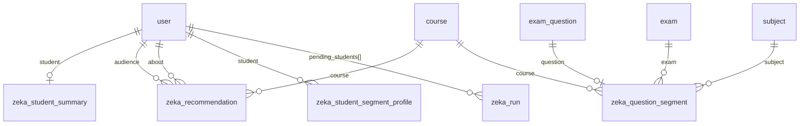

# ZEKA için okul veritabanına eklenecek tablolar

> ## ⏸️ BU BELGE İLERİYE DÖNÜK TAŞIMA PLANIDIR — BUGÜNKÜ DURUM DEĞİLDİR
>
> **Bugün yürürlükte olan:** ZEKA kendi ayrı şemasını kullanır
> (`service/schema/zeka.surql`, `docs/DEPOLAMA.md`). Kod, testler ve çıktı
> sözleşmesi o şemaya göredir ve öyle kalacaktır.
>
> Bu belge, çıktıların ileride okulun tek ortak veritabanına taşınmasına karar
> verildiğinde uygulanacak tasarımı saklar. **Şimdilik uygulanmayacaktır.**

> **Kime:** backend ekibi (taşıma günü geldiğinde).
> **Kapsam:** ZEKA'nın çıktısı ayrı bir veritabanında değil, **okulun kendi
> veritabanında** duracak. Bu belge eklenmesi gereken beş tabloyu, alanlarını ve
> mevcut tablolarla ilişkilerini verir.

---

## 0. Tasarım kuralları (mevcut şemadan alındı)

Bu tablolar backend'in kendi kurallarına uyar; ayrı bir dünya kurmaz.

| Kural | Neden |
|---|---|
| **`school` alanı YOK** | Her okul zaten ayrı veritabanında (`tenant.rs`). Kiracı, veritabanının kendisidir. |
| **Kimlikler kayıt bağı** (`record<user>`, `record<exam_question>`) | Mevcut şemanın deseni (`exam_answer.user: record<user>`). Metin kimlik kullanılmaz. |
| **`SCHEMAFULL`** | 60 tablonun tamamı öyle. Tanımsız alan sessizce düşer. |
| **Zaman `int` unix-ms** | `domain/timestamp.rs`. `datetime` kullanılmaz. |
| **Ad öneki `zeka_`** | 60 mevcut tabloyla çakışmayı önler, sahipliği görünür kılar. |
| **Kompozit kimlik** | Gecelik üzerine yazım için (`{user}_{...}`), `domain/key.rs` deseni. |
| **`retain_until` + indeks** | Saklama süpürmesi bu alanı tarar. |

**Yazan taraf yalnız ZEKA'dır.** Backend bu tablolara yazmaz, yalnız okur.
ZEKA mevcut 60 tablonun hiçbirine yazmaz.

---

## 1. `zeka_student_summary` — öğrenci başına gecelik özet

Kimlik: `{user_key}` — öğrenci başına tek satır, her gece üzerine yazılır.

| Alan | Tip | Açıklama |
|---|---|---|
| `student` | `record<user>` | Özetin sahibi |
| `marks` | `option<object> FLEXIBLE` | Ders bazında not durumu, bant, kohort konumu |
| `attendance` | `option<object> FLEXIBLE` | Ders bazında devam oranı ve kohort karşılaştırması |
| `submission` | `option<object> FLEXIBLE` | Teslim disiplini, geç ve eksik oranları |
| `study` | `option<object> FLEXIBLE` | Çalışma düzeni, haftalık hacim |
| `attention` | `option<array<object>>` | **Dikkat listesi maddeleri — öğrenciye ve veliye gösterilmez** |
| `confidence` | `string` | `yeterli` / `dusuk` / `yok` |
| `computed_at` | `int` | Hesaplanma anı |
| `retain_until` | `int` | Silinme sınırı |

İndeks: `student` · `retain_until`

---

## 2. `zeka_recommendation` — tavsiyeler

Kimlik: ULID (`monotonic_id::next_ulid` deseni) — öğrenci başına çok satır.

| Alan | Tip | Açıklama |
|---|---|---|
| `audience` | `record<user>` | Kime gösterilecek |
| `audience_role` | `string` | `student` / `teacher` / `manager` |
| `about` | `option<record<user>>` | Hangi öğrenci hakkında (öğretmen tavsiyelerinde dolu) |
| `product` | `string` | `O1`, `O3`, `T3`, `T4`… |
| `rule_id` | `string` | `T4.homework` gibi kural kimliği |
| `rule_version` | `int` | Kural sürümü |
| `course` | `option<record<course>>` | İlgili ders |
| `evidence` | `object FLEXIBLE` | Gerekçe — **boşsa satır yazılmaz** |
| `confidence` | `string` | Güven |
| `created_at` | `int` | Üretim anı |
| `expires_at` | `int` | Gösterim sonu |
| `retain_until` | `int` | Silinme sınırı |
| `dismissed_at` | `option<int>` | Kullanıcı kapattıysa |
| `dismissed_by` | `option<record<user>>` | Kim kapattı |
| `dismiss_reason` | `option<string>` | Gerekçesi |

İndeks: `audience, created_at` · `about, product` · `rule_id, created_at` · `retain_until`

> **Dikkat:** ZEKA bu tabloya `UPSERT ... MERGE` ile yazar. `CONTENT` kullanılırsa
> kullanıcının kapatma kaydı her gece silinir.

---

## 3. `zeka_run` — gece işinin defteri

Kimlik: ULID.

| Alan | Tip |
|---|---|
| `started_at`, `finished_at` | `int`, `option<int>` |
| `status` | `string` (`ok` / `partial` / `failed`) |
| `duration_ms` | `option<int>` |
| `students_total`, `students_ok`, `students_failed`, `students_skipped` | `int` |
| `rows_written` | `int` |
| `pending_students` | `option<array<record<user>>>` — bütçe dolduğu için ertesi geceye kalanlar |
| `failed_modules` | `option<array<string>>` |
| `budget_exceeded` | `bool` |
| `budget_ms` | `int` |
| `retain_until` | `int` |

İndeks: `started_at` · `retain_until`

---

## 4. `zeka_question_segment` — soru başına bilişsel etiket

Kimlik: `{exam_question_key}` — soru başına tek satır.

| Alan | Tip | Açıklama |
|---|---|---|
| `question` | `record<exam_question>` | Etiketlenen soru |
| `exam` | `option<record<exam>>` | Hangi sınav |
| `course` | `option<record<course>>` | Hangi ders |
| `subject` | `option<record<subject>>` | Hangi konu |
| `bilissel_talep` | `string` | `hatirlama` / `uygulama` / `analiz` |
| `dikkat_tuzagi` | `string` | `var` / `yok` |
| `okuma_yuku` | `string` | `dusuk` / `yuksek` |
| `adim_sayisi` | `string` | `tek_adim` / `cok_adim` — **deneysel** |
| `confidence_*` | `float` ×4 | Boyut başına güven |
| `confidence` | `string` | Genel güven |
| `downstream_dimensions` | `option<array<string>>` | Aşağı akışta kullanılan boyutlar |
| `experimental_dimensions` | `option<array<string>>` | Kullanılmayanlar ve sebebi satırdan okunur |
| `trap_choice` | `option<string>` | Tuzak şıkkın kimliği (`exam_question.choices[].id`) |
| `rationale` | `string` | Kısa gerekçe — **öğrenciye gösterilmez** |
| `model`, `prompt_version`, `variant` | `string`, `string`, `option<string>` | Üretim izi |
| `computed_at`, `retain_until` | `int` | |

İndeks: `question` · `exam` · `subject` · `course, bilissel_talep` · `retain_until`

---

## 5. `zeka_student_segment_profile` — öğrenci × boyut × etiket

Kimlik: `{user_key}_{dimension}_{label}`.

| Alan | Tip | Açıklama |
|---|---|---|
| `student` | `record<user>` | |
| `dimension` | `string` | `bilissel_talep` / `dikkat_tuzagi` / `okuma_yuku` |
| `label` | `string` | O boyutun etiketi |
| `n_answers`, `n_correct` | `int` | Bu segmentteki cevap ve doğru sayısı |
| `accuracy` | `float` | Segment doğruluğu — **tek başına kullanılmaz** |
| `overall_n_answers`, `overall_accuracy` | `int`, `float` | Öğrencinin genel değerleri |
| `contrast` | `float` | **`accuracy − overall_accuracy`. Asıl kullanılacak alan.** |
| `confidence` | `string` | |
| `computed_at`, `retain_until` | `int` | |

İndeks: `student` · `dimension, label` · `retain_until`

> **Neden `contrast`:** ham doğruluk öğrencinin genel yeteneğini yansıtır; iyi
> öğrenci her segmentte iyi görünür. Ayrım gücü yalnız öğrencinin kendi
> ortalamasından sapmasındadır.

---

## 6. İlişki haritası

Mevcut tablolardan **yalnız beşine** bağlanılıyor: `user`, `course`, `exam`,
`exam_question`, `subject`. Hiçbirine yazılmıyor.

---

## 7. Cascade ve yaşam döngüsü

| Olay | Beklenen davranış |
|---|---|
| Öğrenci silinir | `zeka_student_summary`, `zeka_student_segment_profile` ve o öğrenciye ait `zeka_recommendation` satırları silinmeli |
| Soru silinir | `zeka_question_segment` satırı silinmeli |
| Ders silinir | `zeka_recommendation.course` boşaltılmalı ya da satır silinmeli |
| Dönem arşivlenir | Satırlar korunur; salt okunur |

Mevcut şemada yabancı anahtar zorlanmıyor ve cascade uygulama
transaction'larında yapılıyor. Bu tablolar da aynı yolu izlemeli, aksi hâlde
öğrenci silindiğinde ZEKA satırları öksüz kalır.

`retain_until` süpürmesini ZEKA kendi zamanlayıcısında koşturur; backend'in
ek bir iş yapması gerekmez.

---

## 8. Yazma yetkisi

ZEKA bu beş tabloya yazar. Önerilen: okul veritabanında **yalnız bu beş tabloya
yazma, kalan 60 tabloya salt okuma** yetkisi olan bir veritabanı kullanıcısı.
Bugün geliştirme sırasında tam yetkili kullanıcı kullanılıyor; üretimde
daraltılmalıdır.

---

## 9. Hazır DDL

`service/schema/zeka.surql` bu tabloların çalışan DDL'ini içerir. Ancak **o dosya
ayrı veritabanı varsayımıyla yazılmıştır**: her tabloda `school: string` alanı
taşır ve kayıt bağı yerine metin kimlik kullanır. Okul veritabanına taşınırken
bu belgedeki biçime uyarlanması gerekir.

Uyarlama listesi:
1. `school` alanını ve ona dayalı indeksleri kaldır
2. `student`, `audience`, `about`, `dismissed_by` → `record<user>`
3. `question` → `record<exam_question>`, `exam` → `record<exam>`,
   `course` → `record<course>`, `subject` → `record<subject>`
4. `pending_students` → `option<array<record<user>>>`
5. Tablo adlarına `zeka_` öneki ekle
6. Kompozit kimliklerden okul segmentini çıkar

---

## 10. Bilinen tuzak

SurrealDB, RPC ile gönderilen `user:01K...` biçimli **metni** uçta kayıt tipine
çevirir. `TYPE string` alan bunu reddeder ve **grubun tamamı düşer**; okuma
tarafında aynı durum **sessiz boş sonuç** verir. Kayıt bağına geçildiğinde bu
sorun kendiliğinden ortadan kalkar — bu, metin kimlik yerine `record<>`
kullanmanın ikinci gerekçesidir.
