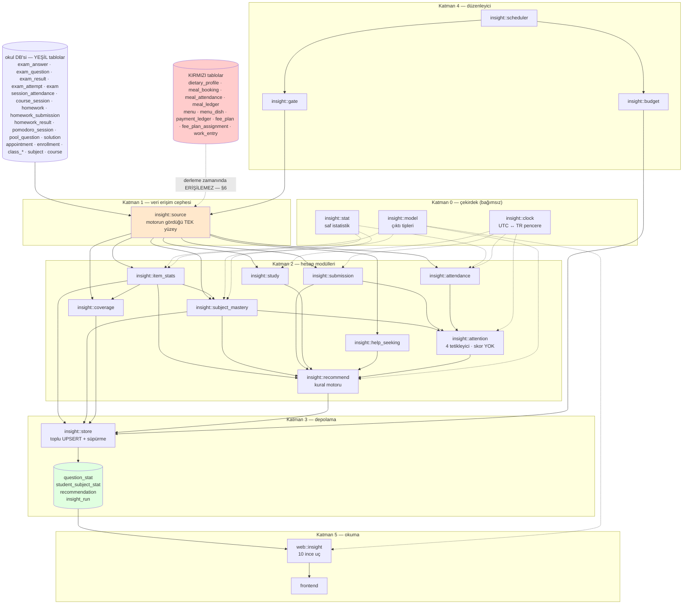
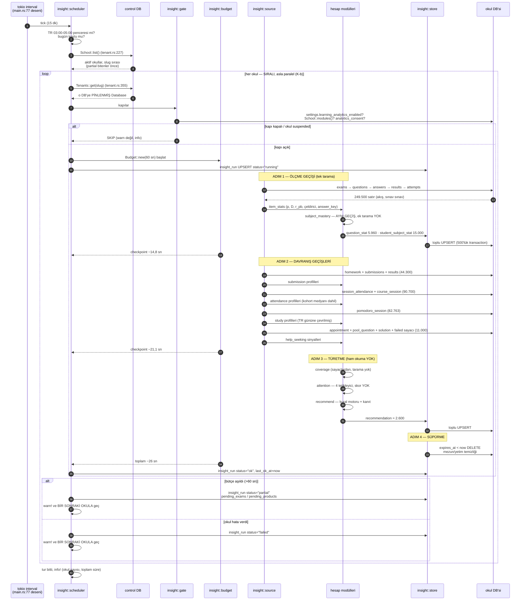

# MODÜLLER — Hezarfen Öğrenci Analizi ve Tavsiye Sistemi: Yazılım Modülü Tasarımı

> **Amaç:** `_analiz_raporlari/20_tavsiye_sistemi_tasarim.md`'deki 12 ürünlük katalog ve
> "gece hesapla, gündüz oku" mimari kararını **yazılabilir Rust modüllerine** çevirmek.
> Bu belge *ne* yapılacağını değil, **hangi modülün hangi alanı okuyup hangi formülle ne
> ürettiğini** tanımlar.
> **Tarih:** 2026-09-13 · **Durum:** tasarım taslağı, hiçbir kod yazılmadı, hiçbir kaynak dosya değiştirilmedi.

## Kaynaklar ve işaretler

| İşaret | Kaynak |
|---|---|
| `[T§n]` | `_analiz_raporlari/20_tavsiye_sistemi_tasarim.md`, bölüm n |
| `[L-n]` | `_analiz_raporlari/30_literatur_arastirma.md`, Bulgu n |
| `[S]` | `hezarfen-ZEKA/spec/schema.json` — **tüm alan adları buradan alındı, elle yazılmadı** |
| `[N§n]` | `hezarfen-ZEKA/spec/SENARYO.md`, bölüm n |
| `[M]` | `hezarfen-ZEKA/seed/MANIFEST.json` — gerçek satır sayıları ve gerçek ölçümler |
| `dosya:satır` | `hezarfen_backend-main/src/` altındaki gerçek kod |
| `(doğrulanmadı)` | bu belgede kanıta bağlanamadı |

### Tohum veri hacmi — tüm bütçe hesapları bu sayılarla yapıldı (`[M]` → `tablo_satir_sayilari`)

| Tablo | Satır | Tablo | Satır | Tablo | Satır |
|---|---:|---|---:|---|---:|
| `exam_answer` | **217.498** | `session_attendance` | **86.368** | `pomodoro_session` | **82.763** |
| `homework_submission` | 23.747 | `homework_result` | 19.950 | `exam_attempt` | 14.227 |
| `exam_result` | 11.795 | `chatbot_message` | 9.098 | `exam_question` | 5.960 |
| `course_session` | 4.329 | `enrollment` | 2.738 | `bank_question` | 885 |
| `solution` | 780 | `pool_question` | 640 | `homework` | 590 |
| `user` | 563 | `appointment` | 502 | `subject` | 390 |
| `exam` | 340 | `parent_link` | 299 | `class_member` | 250 |
| `class_course` | 110 | `course` | 50 | `class_group` | 11 |
| **Toplam satır** | **570.989** | Öğretim haftası | 27 | `t_now` | 2026-04-13T05:00Z |

Rol dağılımı: **250 öğrenci · 24 öğretmen · 285 veli** (`[M]` H2/H3/H4).

**Okul başına bütçe: ≤ 60 saniye** (`[T§5.3]`). Bu belgedeki toplam tahmin: **≈ 26 saniye**
(§3.6). Marj ≈ 2,3×.

---

## 0. Üç tasarım kuralı (her modül bunlara uyar)

1. **Model yok; kural ve klasik istatistik var.**
   `[L-1]`: bizim profilimizde (öğrenci başına 1.500–4.000 cevap — tohumda **881 choice
   cevap/öğrenci**, `[N§7.2]` L1) lojistik regresyon/PFA hattı DKT ve SAKT'ı geçiyor
   (spanish veri kümesi, N=182: Best-LR 0.863 vs DKT 0.832 vs SAKT 0.831). **Ama** bu
   kazanımlar **kazanım (KC) etiketli** girdide üretildi; bizde kazanım kodu **yok** —
   `[S]` `subject.fields` = `course, name, description, exam_question_count, homework_count`,
   başka hiçbir kimlik alanı yok. `[L-3]`: vanilla DKT çıktısı ustalık göstergesi ya da
   ilerleme grafiği olarak panele **yapısal olarak basılamaz** (iyi performansta tahmin
   düşebiliyor, adımlar arası dalgalanma). `[L-1]`'in "zamansal sinyal belirleyici olduğunda
   DKT önde" istisnası bizde **tetiklenmiyor**, çünkü soru bazında süre verisi yok
   (`exam_answer.updated_at` UPSERT'te eziliyor — `db/exam_answer.rs:75`).
   **Sonuç: bu belgedeki hiçbir modül eğitilmiş model içermez.**
2. **Havuzlama bağlam gözetir.**
   `[L-6]` (Gašević ve ark. 2016, n=4.134 / 9 ders; Conijn ve ark. 2017 ile replike):
   bağlam hesaba katılmadan havuzlanan katsayılar sistematik olarak sapıyor (toplulaştırma
   yanlılığı — bazı bağlamlarda yukarı, bazılarında aşağı). Bizim karşılığımız:
   **referans dağılımı her zaman `class_course` (şube × ders) düzeyinde** kurulur.
   Okul geneli havuzdan **hiçbir yerde** öğrenci bandı üretilmez (§2.3), ve devamsızlık
   tetikleyicisi **sınıf medyanına göre göreli** ölçülür (§2.5, §2.8).
3. **Örneklem eşiği amaca göre değişir.**
   `[L-5]` (Linacre 1994, ~996 atıflı sektör heuristiği — hakemli deney değil):
   ±1 logit/%95 için ~30 gözlem **keşifseldir**; ±0,5 logit için 100–250; yüksek riskli
   kalibrasyon için 250 ilâ 20×test uzunluğu. Şerh (a): "2PL/3PL ve **ayırt edicilik**
   parametresi için literatür 500–1000+ örneklem ister — 250 ile ayırt edicilik güvenilir
   DEĞİLDİR". Şerh (e): tek sınıf düzeyinde üretilen zorluk kestirimleri **keşifseldir**,
   öğrenciye/veliye gösterilecek karara tek başına girmemelidir.
   Bu yüzden `[T§3 T2]`'nin `n ≥ 30` kapısı bu belgede **iki kademelidir**:
   `n ∈ [30,100)` → **"ön bulgu"**, `n ≥ 100` → **"kararlı"**; ve D hiçbir koşulda
   otomatik bir eyleme bağlanmaz (§2.2).
   Ek bir dürüstlük notu: `[L-8]` erken uyarı sistemlerinin **etkisi** konusunda bu turda
   güçlü nedensel kanıt bulamadı (incelenen kaynak 5 pilot okulluk, düşük güçlü bir
   fark-içinde-fark değerlendirmesi). Yani `insight::attention`'ın işe yaradığı **iddia
   edilemez**; §2.8'in başarı kriteri kendi ölçümümüzdür.

---

## 1. Modül haritası



### 1.1 Tek cümlelik sorumluluklar

| Modül | Sorumluluk |
|---|---|
| `insight::model` | Tüm hesap modüllerinin paylaştığı çıktı tiplerini (bant, kanıt, tetikleyici, güven kademesi) tanımlar. |
| `insight::stat` | p, D, nokta-çift serili korelasyon, z, medyan, Wilson aralığı gibi saf istatistik ilkellerini sağlar. |
| `insight::clock` | UTC milisaniyeyi TR (UTC+3) gününe/haftasına çevirir ve 30/14/7 günlük pencere sınırlarını üretir. |
| `insight::source` | Motorun okuyabileceği **tek** veri yüzeyidir; kırmızı katman tablolarına erişen fonksiyon burada **yoktur**. |
| `insight::item_stats` | Her `exam_question` için p-değeri, ayırt edicilik, çeldirici dağılımı ve cevap anahtarı dondurmasını üretir. |
| `insight::subject_mastery` | Öğrenci × konu doğruluk oranını ve **şube-ders** dağılımındaki konumunu güven kapısıyla üretir. |
| `insight::submission` | Ödev teslim zamanlaması ve erteleme profilini `counted_on_time` üzerinden çıkarır. |
| `insight::attendance` | Devam oranı eğilimini ve **kolektif olaydan ayrıştırılmış** bireysel düşüşü tespit eder. |
| `insight::study` | Pomodoro oturumlarından çalışma düzenliliğini ve gün/saat desenini **ham log'dan** hesaplar. |
| `insight::help_seeking` | Karşılıksız kalmış yardım arama girişimlerini (randevu, havuz sorusu, başarısız sohbet **sayısı**) toplar. |
| `insight::coverage` | Ölçme pratiğinin sağlığını (ölçülmemiş konu, madde kalitesi histogramı, notlanmamış sınav) çıkarır. |
| `insight::attention` | Dört bağımsız tetikleyiciyi ayrı ayrı değerlendirir — **tek skor üretmez, sıralama yapmaz**. |
| `insight::recommend` | Yukarıdakilerin çıktısını kural kimliği + sürüm + kanıt taşıyan `recommendation` satırlarına çevirir. |
| `insight::store` | Materyalize tablolara toplu UPSERT yapar ve saklama süresini süpürür. |
| `insight::budget` | Okul başına 60 saniyelik pencereyi ölçer; aşımda hattı **kısmi ama tutarlı** sonuçla durdurur. |
| `insight::gate` | Okulu çalıştırmadan önce modül, okul ayarı ve rıza kapılarını uygular. |
| `insight::scheduler` | Gece penceresinde okulları **sıralı** dolaşır ve her okul için hattı koşturur. |
| `web::insight` | Materyalize satırları, **mevcut yetki kapılarını yeniden kullanarak** okur. |

### 1.2 Dosya yerleşimi (mevcut repo desenine uyumlu)

```
src/insight/mod.rs          — hat orkestrasyonu (run_for_school)
src/insight/model.rs        src/insight/stat.rs        src/insight/clock.rs
src/insight/source.rs       ← §6 Kapı 1
src/insight/item_stats.rs   src/insight/subject_mastery.rs
src/insight/submission.rs   src/insight/attendance.rs
src/insight/study.rs        src/insight/help_seeking.rs
src/insight/coverage.rs     src/insight/attention.rs
src/insight/recommend.rs    src/insight/store.rs
src/insight/scheduler.rs    src/insight/budget.rs      src/insight/gate.rs
src/db/question_stat.rs     src/db/student_subject_stat.rs
src/db/recommendation.rs    src/db/insight_run.rs
src/web/insight.rs          ← lib.rs:131 build_router içinde nest edilir
tests/insight_forbidden_tables.rs   tests/ai_allowlist_red_layer.rs
tests/insight_no_write_back.rs      tests/regress_insight.rs
```

---
## 2. Modül künyeleri

Künye başlıkları her modülde aynıdır: **Sorumluluk · Girdi · Çıktı · Algoritma · Güven
kapıları · Ne zaman koşar · Karmaşıklık ve bütçe · Hangi ürünleri besler · Bağımlılıklar ·
Hata davranışı · Tohum verisiyle sınama.**

---

### 2.0 Destek modülleri (kısa künye)

#### `insight::model`
- **Sorumluluk:** Hesap modüllerinin paylaştığı çıktı tiplerini tanımlar; hiçbir I/O yapmaz.
- **Çıktı tipleri:** `Band { Review, OnTrack, Strong, InsufficientData }` (`student_subject_stat.band`
  alanının Rust karşılığı), `Confidence { None, Exploratory, Stable }` (§0 kural 3),
  `Evidence(serde_json::Map)` (`recommendation.evidence` FLEXIBLE objesi),
  `Trigger { Attendance, Homework, MarkTrend, ExamMissed }`, `RuleId(&'static str)`,
  `RuleVersion(i64)`.
- **Ne zaman koşar:** —. **Bütçe:** 0.
- **Karar:** Bant adları `[T§3 Ö1]`'deki üç bant + veri yok. "zayıf" kelimesi tip düzeyinde
  **yoktur** — `Review` ("tekrar önerilir") vardır. Bu, `[T§3 Ö1]`'in sınırlamasını isim
  düzeyinde sabitler.

#### `insight::stat`
- **Sorumluluk:** Saf, test edilebilir istatistik fonksiyonları; `Database` görmez.
- **API:** `p_value(correct,answered) -> Option<f64>` · `discrimination_27(scores:&[(f64,bool)]) -> Option<f64>`
  · `point_biserial(scores:&[(f64,bool)]) -> Option<f64>` · `z_score(x,mean,sd) -> Option<f64>`
  · `median_i64(&mut [i64]) -> Option<i64>` · `wilson_interval(k,n,z) -> (f64,f64)`
  · `mean_sd(&[f64]) -> (f64,f64)`.
- **Formüller:**
  - `p = doğru / cevaplanmış`
  - `D = p(üst %27) − p(alt %27)`; gruplar sınav içi `exam_result.mark` sıralamasından,
    `ceil(0,27·n)` kişilik uçlarla.
  - `r_pb = ((M₁ − M₀)/s_x)·√(p·q)`; `M₁` doğru cevaplayanların toplam puan ortalaması,
    `M₀` yanlış cevaplayanlarınki, `s_x` toplam puanın **popülasyon** standart sapması,
    `q = 1 − p`. `s_x = 0` ise `None`.
  - `z = (x − μ)/σ`; **σ tabanı 0,05** — sıfıra yakın σ'da z patlamasın diye (aksi halde
    homojen bir şubede 1 soruluk fark "çok güçlü" olur). Bu taban bir **mühendislik
    kararıdır**, literatürden gelmez `(doğrulanmadı)`.
  - Wilson: `(k + z²/2)/(n + z²) ± (z/(n+z²))·√(k·q + z²/4)`, `z = 1,96`.
- **Bütçe:** ihmal edilebilir (tümü O(n) veya O(n log n) sıralama).

#### `insight::clock`
- **Sorumluluk:** Her zaman hesabını TR yerel gününe sabitler.
- **Neden gerekli:** `[S]` `time_and_value_formats.timestamps` — tüm damgalar `i64 unix
  MILLISECONDS, UTC`; gün sınırı UTC gece yarısıdır. `[S]` `day_numbers`:
  `user.study_streak_last_day` ve `user.pomodoro_counted_day` **UTC gününden** türetiliyor
  (`day_number = floor(unix_ms/86400000) + 719163`). TR gece 00:00–03:00 çalışma **önceki
  UTC gününe** yazılıyor — `[T§3 Ö3]` ve `[T§8.1 R10]`.
- **API:** `tr_day(ms) -> i32` · `tr_week_start(ms) -> i64` (Pazartesi 00:00 TR)
  · `window(now, days) -> (from_ms, to_ms)` · `tr_hour(ms) -> u8` · `tr_weekday(ms) -> u8`.
- **Sabit:** `TR_OFFSET_MS = 3 * 3_600_000`. Türkiye 2016'dan beri kalıcı UTC+3, yaz saati
  yok — bu yüzden sabit ofset yeterlidir `(doğrulanmadı: mevzuat teyidi bu belgede yapılmadı)`.
- **Bütçe:** ihmal edilebilir.

---

### 2.1 `insight::source` — veri erişim cephesi

- **Sorumluluk:** Motorun okuyabileceği **tek** veri yüzeyini sunar; kırmızı katman
  tablolarına erişen bir fonksiyon bu modülde **bulunmadığı için** motor kodu onları
  çağıramaz — derlenmez.

- **Girdi:** Tek bir `&Database` handle'ı — `Tenants::get(&slug)` ile o okula **pinlenmiş**
  (`tenant.rs:355`). Cephe bu handle'ı `pub` yapmaz, sarar.

- **Çıktı:** Aşağıdaki imzalar. Dönüş tipleri mevcut `domain::` tipleridir; yeni DTO icat
  edilmez.

```rust
// src/insight/source.rs — motorun görebildiği TEK veri yüzeyi.
//
// KURAL: bu dosyaya bir fonksiyon eklemek, tavsiye motorunun erişim alanını
// genişletmektir. dietary_profile / meal_* / menu* / payment_* / fee_plan* /
// work_entry tabloları KASITLI OLARAK YOKTUR ve eklenemez (§6, tests/insight_forbidden_tables.rs).

pub struct InsightSource<'a> {
    db: &'a Database,          // private — dışarı sızdırılmaz
    modules: ModuleSet,        // School::modules(); kapalı modülün okuması hiç yapılmaz
}

impl<'a> InsightSource<'a> {
    pub fn new(db: &'a Database, modules: ModuleSet) -> Self;

    // ---- yapı ----
    pub async fn courses(&self) -> Result<Vec<Course>, AppError>;
    pub async fn subjects_for_course(&self, c: &CourseId) -> Result<Vec<Subject>, AppError>;
    pub async fn class_groups(&self) -> Result<Vec<ClassGroup>, AppError>;
    pub async fn class_courses(&self) -> Result<Vec<ClassCourse>, AppError>;
    pub async fn class_members(&self) -> Result<Vec<ClassMember>, AppError>;
    pub async fn enrollments_for_course(&self, c: &CourseId) -> Result<Vec<Enrollment>, AppError>;
    pub async fn students(&self) -> Result<Vec<UserId>, AppError>;   // role='student' SADECE
    pub async fn parent_links(&self) -> Result<Vec<ParentLink>, AppError>;

    // ---- ölçme ----
    pub async fn exams_for_course(&self, c: &CourseId) -> Result<Vec<Exam>, AppError>;
    pub async fn questions_for_exam(&self, e: &ExamId) -> Result<Vec<ExamQuestion>, AppError>;
    pub async fn answers_for_exam(&self, e: &ExamId) -> Result<Vec<ExamAnswer>, AppError>;
    pub async fn results_for_exam(&self, e: &ExamId) -> Result<Vec<ExamResult>, AppError>;
    pub async fn attempts_for_exam(&self, e: &ExamId) -> Result<Vec<ExamAttempt>, AppError>;
    pub async fn bank_questions(&self) -> Result<Vec<BankQuestion>, AppError>;

    // ---- davranış (yeşil) ----
    pub async fn sessions_for_course(&self, c: &CourseId) -> Result<Vec<CourseSession>, AppError>;
    pub async fn attendance_for_course(&self, c: &CourseId) -> Result<Vec<SessionAttendance>, AppError>;
    pub async fn homework_for_course(&self, c: &CourseId) -> Result<Vec<Homework>, AppError>;
    pub async fn submissions_for_homework(&self, h: &HomeworkId) -> Result<Vec<HomeworkSubmission>, AppError>;
    pub async fn results_for_homework(&self, h: &HomeworkId) -> Result<Vec<HomeworkResult>, AppError>;
    pub async fn pomodoro_since(&self, from_ms: i64) -> Result<Vec<PomodoroSession>, AppError>;

    // ---- yardım arama ----
    pub async fn pool_questions(&self) -> Result<Vec<PoolQuestion>, AppError>;
    pub async fn solution_counts(&self) -> Result<HashMap<PoolQuestionId, u32>, AppError>;
    pub async fn appointments(&self) -> Result<Vec<Appointment>, AppError>;
    /// SADECE SAYIM. Metin, thread, konu DÖNMEZ — dönüş tipi bir sayaçtır (§6, T5 (c)).
    pub async fn failed_chat_counts(&self, from_ms: i64) -> Result<HashMap<UserId, u32>, AppError>;

    // dietary_profile / meal_booking / meal_attendance / meal_ledger / menu / menu_dish /
    // payment_ledger / fee_plan / fee_plan_assignment / work_entry: KASITLI OLARAK YOK.
}
```

- **Okunan tablolar ve alanlar (`[S]`'ten, tam adlarıyla):**

| Tablo | Okunan alanlar | Filtre | İndeks |
|---|---|---|---|
| `exam_answer` | `exam`, `question`, `user`, `selected`, `text`, `updated_at`, `seq` | `exam = $e` | `exam_answer_exam(exam)` |
| `exam_question` | `exam`, `text`, `kind`, `points`, `choices[*].id`, `choices[*].text`, `correct`, `subject`, `from_bank`, `banked_as` | `exam = $e` | `exam_question_exam(exam)` |
| `exam_result` | `exam`, `user`, `mark`, `graded_by`, `seq` | `exam = $e` | `exam_result_exam_user_seq` (UNIQUE) |
| `exam_attempt` | `exam`, `user`, `seq`, `started_at`, `finished_at`, `left_at` | `exam = $e` | `exam_attempt_exam(exam)` |
| `exam` | `creator`, `course`, `title`, `kind`, `mode`, `starts_at`, `ends_at`, `duration_ms`, `max_attempts`, `allow_review`, `draft`, `result_count` | `course = $c`, `draft = false` | `exam_course(course)` |
| `session_attendance` | `session`, `course`, `user`, `status`, `marked_by` | `course = $c` | `session_attendance_course(course)` |
| `course_session` | `course`, `teacher`, `topic`, `starts_at`, `ends_at`, `held_counted_at` | `course = $c` | `course_session_course(course)` |
| `homework` | `course`, `subject`, `title`, `due_at`, `assigned[*]`, `created_by`, `created_at` | `course = $c` | `homework_course(course)` |
| `homework_submission` | `homework`, `user`, `submitted_at`, `updated_at`, `counted_on_time`, `graded_by_result`, `file_count` | `homework = $h` | `homework_submission_homework` |
| `homework_result` | `homework`, `user`, `status`, `mark`, `graded_by`, `created_at` | `homework = $h` | `homework_result_homework` |
| `pomodoro_session` | `user`, `started_at`, `finished_at`, `counted` | `started_at >= $from` | `pomodoro_session_user(user)` — **zaman indeksi YOK** |
| `pool_question` | `asker`, `title`, `status`, `asked_at`, `approved_by` | `status = 'approved'` | `pool_question_status(status)` |
| `solution` | `question`, `author`, `offered_at` | — | `solution_question(question)` |
| `appointment` | `slot`, `requester`, `status`, `created_at` | `status = 'pending'` | `appointment_status(status)` |
| `chatbot_message` | **yalnız** `thread`, `status`, `created_at` — `content` **okunmaz** | `status = 'failed'` | — |
| `subject`, `course`, `class_*`, `enrollment`, `user`, `parent_link` | yapı alanları | — | çeşitli |

- **Algoritma:** Yok — cephe saf I/O. Sorgu deseni mevcut `db/` katmanındaki desenin aynısı:
  `db.query("SELECT * FROM t WHERE f = $p").bind(("p", id.record()))` (`db/exam_answer.rs:191`).
  Modül kapısı: `self.modules.contains(Module::Exams)` yanlışsa sınav okumaları **hiç
  yapılmaz**, boş `Vec` döner (`module.rs:26-52`, K-j).

- **Güven kapıları:** Yok (veri katmanı). Yalnız **yokluk sözleşmesi**: bir tablo boşsa
  `Ok(vec![])` döner, `Err` değil — yukarıdaki modüller "veri yok" ile "hata" ayrımını
  buradan alır.

- **Ne zaman koşar:** Her hesap modülünün içinden, gece işi sırasında. Okuma uçlarından
  **hiç** çağrılmaz (okuma ucu materyalize satırı okur, `db/` üzerinden).

- **Karmaşıklık ve bütçe:** Cephe kendi başına maliyetsizdir; maliyet çağıranlara yazılır.
  Toplam okunan satır bütçesi (tohum): 217.498 + 86.368 + 82.763 + 23.747 + 19.950 +
  14.227 + 11.795 + 5.960 + 4.329 ≈ **466.600 satır**. 40.000 satır/sn muhafazakâr
  çözümleme hızıyla ≈ **11,7 sn** `(doğrulanmadı: SurrealDB sorgu planı koşulmadı —
  `[T§8.2 V7]`)`.
  **Bellek:** en büyük sınavın cevapları (217.498/340 ≈ 640 ortalama; en büyük sınav
  ≈ 5.000 satır) + sayaç haritaları. Sınav sınav akış ile tepe bellek **< 15 MB/okul**.

- **Hangi ürünleri besler:** Hepsi (Ö1–Ö5, T1–T5, V1, Y1) — dolaylı.

- **Bağımlılıklar:** Yok. Hattın ilk modülü.

- **Hata davranışı:**
  - DB düşerse `AppError` yukarı gider → `scheduler` o okulu atlar, `warn` loglar, bir
    sonraki geceye bırakır (`main.rs:77` keepalive'ın `db_up` deseninin muadili).
  - Modül kapalıysa boş liste — hata değil.
  - **Tablo yoksa** (yeni okul, göç koşmamış) boş liste.

- **Tohum verisiyle sınama:** `source.students().len() == 250`, `source.courses().len() == 50`,
  `source.subjects` toplamı `390`, `class_courses().len() == 110` (`[M]` H2/H7/H8/H11 —
  hepsi "kesin" toleranslı). `answers_for_exam` 340 sınav üzerinde toplandığında
  **217.498** satır vermelidir.
  **Ve kritik olan:** `tests/insight_forbidden_tables.rs` (§6 Kapı 2) yeşil olmalıdır —
  yani bu dosyada `meal_ledger` gibi bir ad **geçmemelidir**.

---

### 2.2 `insight::item_stats` — madde analizi

- **Sorumluluk:** Her `exam_question` için zorluk, ayırt edicilik, çeldirici dağılımı ve
  boş bırakma oranını, hesap anındaki cevap anahtarıyla **dondurarak** üretir.

- **Girdi:**

| Tablo | Alanlar | Filtre |
|---|---|---|
| `exam` | `course`, `ends_at`, `starts_at`, `draft`, `allow_review`, `result_count` | `draft = false` **ve** (`ends_at` NONE veya `ends_at < now`) — süren sınav analiz edilmez |
| `exam_question` | `id`, `exam`, `kind`, `points`, `choices[*].id`, `correct`, `subject`, `from_bank`, `banked_as` | `exam = $e` |
| `exam_answer` | `question`, `user`, `selected`, `seq` | `exam = $e` — **yalnız `seq = 1`** (§Algoritma 2) |
| `exam_result` | `user`, `mark`, `seq` | `exam = $e`, `seq = 1` |
| `exam_attempt` | `user`, `seq` | `exam = $e`, `seq = 1` — payda (kaç kişi oturdu) |

- **Çıktı:** `question_stat` tablosuna satır başına (§4.1):
  `question`, `subject`, `n_answered`, `n_enrolled`, `p_value`, `discrimination`,
  `point_biserial`, `choice_counts` (FLEXIBLE `{choice_id: sayı}`), `omission_rate`,
  `answer_key`, `confidence`, `computed_at`.
  Bellekte ayrıca `HashMap<ExamQuestionId, ItemStat>` döndürür — `subject_mastery`,
  `coverage` ve `recommend` bunu **yeniden okumaz**, aynı geçişten alır.

- **Algoritma:**
  1. **Sınav seçimi.** Son koşudan (`insight_run.last_ok_at`) bu yana **yeni cevap almış**
     sınavlar + hiç hesaplanmamış sınavlar. "Yeni cevap almış" ölçütü:
     `max(exam_answer.updated_at) > last_ok_at`. İlk koşuda hepsi (tam backfill).
  2. **Oturum seçimi: yalnız `seq = 1`.** Gerekçe: `[S]` `exam_attempt.id` kuralı —
     `{exam_key}_{user_key}` (seq==1) | `..._{seq}`; retake ayrı satırdır ve eski cevap
     silinmez. Madde zorluğu **ilk karşılaşmanın** özelliğidir; ikinci denemeyi karıştırmak
     p'yi yukarı saptırır. (Retake `subject_mastery`'nin "ilerleme" bölümünde ayrıca
     kullanılır — §2.3.)
  3. **Yalnız `kind = 'choice'`.** `[S]` `exam_question.correct: option<string>`; metin
     sorusunda `correct` NONE'dur ve soru bazında puan **hiçbir yerde saklanmıyor**
     (`exam_result` tek bir 0–100 sayı). `[T§2.2 X3]`. Metin soruları `n_answered` sayılır
     ama `p_value = NONE` yazılır — **sahte sayı yazılmaz**.
  4. **p-değeri.** `p = |{a : a.selected == q.correct}| / |{a : a.selected != NONE}|`.
     Bantlar `[T§3 T1]`: `p < 0,30` çok zor · `0,30–0,80` uygun · `p > 0,90` çok kolay.
  5. **Boş bırakma.** `omission_rate = 1 − n_answered / n_enrolled`, `n_enrolled` =
     bu sınavda `seq=1` `exam_attempt` satırı olan kişi sayısı. `[T§1.2 L3]`: satırın
     **yokluğu** = cevaplanmadı; "bakıp boş bıraktı" ile "hiç bakmadı" ayırt edilemez —
     bu sınır DTO'da `omission_note` olarak taşınır ve UI'da yazılır.
  6. **Çeldirici dağılımı.** `choice_counts[choice.id] += 1`. Anahtar `[S]`
     `exam_question.choices[*].id` — *ulid_random*, "pozisyona değil kimliğe bağlı"
     (`domain/exam_question.rs:122`). Bu yüzden öğretmen şıkları yeniden sıralasa bile
     eski cevaplar doğru şıkka bağlı kalır.
     **Bulgu bayrağı:** `max(choice_counts) > choice_counts[correct]` → "çeldirici doğru
     cevaptan fazla seçildi" (= yaygın kavram yanılgısı **veya** hatalı anahtar).
  7. **Ayırt edicilik.** Sınav içi `exam_result.mark` sıralamasından üst/alt %27 grupları;
     `D = p_üst − p_alt`. Ek olarak `r_pb` (tüm dağılımı kullanır, %27 kesiminden daha
     kararlıdır). Bantlar `[T§3 T2]`: `D ≥ 0,40` iyi · `0,20–0,39` kabul · `0,10–0,19`
     gözden geçir · `< 0,10` elden geçir · `< 0` **anahtar hatası şüphesi**.
  8. **Çapraz-sınav birleştirme (T2 için).** `from_bank ∪ banked_as` üzerinden aynı
     şablonun kopyaları toplanır (`db/exam_question.rs:182-187` deseni). **`from_bank` /
     `banked_as` üzerinde indeks YOK** (`[S]` `exam_question.indexes` = yalnız
     `exam_question_exam`, `exam_question_subject`) → tam tarama; gece işi olmasının
     sebeplerinden biri budur.
     **Iraksama uyarısı:** aynı `from_bank`'a bağlı kopyaların `text` alanının SHA-256
     hash'i farklıysa "bu şablonun kopyaları farklılaşmış" notu; istatistikler yine
     birleştirilir ama uyarıyla.
  9. **Cevap anahtarı dondurma.** `answer_key = q.correct` hesap anında yazılır.
     Gerekçe `[T§4 Ş2]`: `exam_question.correct` **mutable**; sonradan değişirse tüm geçmiş
     istatistikler sessizce değişir. Okuma ucu `answer_key != q.correct` görürse satırı
     **bayat** işaretler ve UI "sınav sonucu güncellendi, yeniden hesaplanacak" der.

- **Güven kapıları:**

| Ölçü | Eşik | Altında ne gösterilir | Kaynak |
|---|---|---|---|
| `p_value` | `n_answered ≥ 5` | Oran gösterilir ama **"küçük örneklem"** uyarısıyla | `[T§3 T1]` |
| `choice_counts` | `n_answered ≥ 5` | Aynı | `[T§3 T1]` |
| `discrimination` / `point_biserial` | **`n ≥ 30`** → `Confidence::Exploratory`; **`n ≥ 100`** → `Confidence::Stable` | `n < 30` → alan **NONE yazılır**, UI "yeterli veri yok" der | `[L-5]` Linacre 1994: ±1 logit/%95 için 16–36 (tipik 30); ±0,5 logit için 64–144 (100) |
| D'ye dayalı **eylem** | **hiçbir eşikte yok** | Soru silinmez, devre dışı bırakılmaz — insan kararı | `[T§6.1]` + `[L-5]` şerh (a): 2PL ayırt ediciliği için 500–1000+ gerekir, 250 ile güvenilir değil |

**Bu iki kademeli kapı, tasarım belgesindeki tek `n ≥ 30` kapısından bilinçli bir sapmadır.**
`[T§3 T2]` "n≥30 altında hiçbir D değeri gösterilmez" diyor; `[L-5]` ise n=30'un yalnızca
±1 logit/%95 bandı verdiğini ve ayırt edicilik için **hiç yeterli olmadığını** söylüyor.
Çözüm: 30 eşiği korunur ama çıktı **"ön bulgu"** olarak etiketlenir; "kararlı" için 100.

- **Ne zaman koşar:**
  - **Gece toplu işi**, hattın **ilk** hesap modülü (diğerleri çıktısını kullanır).
  - **Olay tetikli ince koşu:** bir sınavın notu girildiğinde yalnız o sınavın
    `question_stat`'i (`[T§5.3]`). Rozet `sync` deseni aynen: asıl işlem başarısız olmaz,
    hata yalnız `warn` loglanır (`db/pomodoro.rs:236-238`).

- **Karmaşıklık ve bütçe:**
  - Okuma: 217.498 `exam_answer` + 5.960 `exam_question` + 11.795 `exam_result` +
    14.227 `exam_attempt` ≈ **249.500 satır** → ≈ **6,2 sn**.
  - Hesap: O(cevap) sayım + sınav başına O(n log n) mark sıralaması (n ≤ ~250) → **< 1 sn**.
  - `from_bank` birleştirme: 885 şablon × ortalama ~3 kopya, indekssiz tam tarama üzerinde
    **bellekte** yapılır (tarama zaten yapıldı) → **< 0,3 sn**.
  - Yazma: **5.960** `question_stat` UPSERT, 500'lük toplu transaction'larda ≈ **2 sn**.
  - **Toplam ≈ 9,5 sn / 60 sn.** ✅ Sığıyor.
  - Bellek: sınav başına akış; tepe ≈ 8 MB.
  - **Artımlı koşuda** (ikinci geceden itibaren) yalnız değişen sınavlar → tipik gecede
    birkaç sınav, **< 0,5 sn**.

- **Hangi ürünleri besler:** **T1** (ana), **T2** (ana), **Ö2** (öncelik sıralaması için
  `p_value`), **Y1** (madde kalitesi histogramı), dolaylı **Ö1/T3** (`subject_mastery`
  aynı geçişi kullanır).

- **Bağımlılıklar:** `insight::source`, `insight::stat`. Hattın ilk hesap modülü.

- **Hata davranışı:**
  - `exam_result` yoksa (notlanmamış sınav — tohumda **26 adet**, `[M]` K/L19 gerekçesi)
    → `discrimination = NONE`, `p_value` yine hesaplanır. Ayırt edicilik notu gerektirir,
    zorluk gerektirmez.
  - `correct` NONE (metin sorusu) → `p_value = NONE`, `n_answered` yine yazılır.
  - `from_bank` kopuk (tohumda **48 adet**, `[M]` K6) → şablon birleştirme o soru için
    yapılmaz, madde tek başına raporlanır; `question_stat` yine yazılır. Sessiz düşme yok,
    `evidence.origin_broken = true`.
  - `bank_question.subject` NONE (tohumda **53 adet**, `[M]` K5) → T2 karnesinde konu
    sütunu boş; hata değil.
  - Bütçe aşılırsa → işlenmemiş sınavlar `insight_run.pending_exams`'a yazılır, bir sonraki
    gece **oradan devam eder** (§3.4).

- **Tohum verisiyle sınama (`[N§7.2]`, `[N§7.5]`, gerçekleşen değerler `[M]`):**

| Ölçüm | Beklenen | Tohumda gerçekleşen `[M]` | Kaynak |
|---|---|---|---|
| Madde `p` ortalaması | 0,585 ± 0,03 | **0,5759** | L10 |
| `p < 0,30` madde sayısı | 531 (senaryo) | **223** (üretici a_i dağılımına sadık kaldı) | L11 + `[M]` sapma gerekçesi |
| `p > 0,90` madde sayısı | 531 | **83** | L12 |
| Çeldiricinin doğrudan fazla seçildiği madde | ≥ 120 | **456** | L13 / P12 |
| `n ≥ 30` ile D hesaplanabilen banka şablonu | ≥ 450 / 885 | — (ürün ölçümü) | P13 |
| `D < 0` uyarısı ("anahtar hatası şüphesi") | ≥ 130 şablon | kasıtlı negatif madde **154** | P14 / `[M]` K9 |
| `D < 0,10` uyarısı ("elden geçir") | ≥ 200 şablon | kasıtlı bozuk madde **255** | P15 / `[M]` K10 |
| Iraksama uyarısı (metin hash'i farklı) | ≈ 359 | **316** | P16 / L21 |
| "Yeterli veri yok" denen madde (negatif kontrol) | ≥ 12 | 12 kasıtlı `n<30` | P17 |
| `p < 0,30` uyarısı çıkan sınav | ≥ 150 / 240 | — | P11 |

> **Modül doğru çalışıyorsa:** 5.960 `question_stat` satırı yazılır, bunların **456'sı**
> "çeldirici doğru cevaptan fazla" bayrağı taşır ve **en az 130'u** `D < 0` ile
> "anahtar hatası şüphesi" üretir. Bu üç sayı tutmuyorsa modül yanlıştır, veri değil
> (`[N§3]` giriş cümlesi).

---

### 2.3 `insight::subject_mastery` — öğrenci × konu ustalığı

- **Sorumluluk:** Her (öğrenci, konu) çifti için doğruluk oranını, **şube-ders** referans
  dağılımındaki konumunu ve güven kademesini üretir.

- **Girdi:** `item_stats`'ın **aynı geçişinden** gelen bellekteki cevap tablosu +

| Tablo | Alanlar | Filtre |
|---|---|---|
| `exam_question` | `subject`, `kind`, `correct`, `exam` | `kind = 'choice'` |
| `exam_answer` | `user`, `question`, `selected`, `seq` | tüm `seq` (retake ayrı) |
| `subject` | `course`, `name` | — |
| `class_course` | `class`, `course` | — referans kohortunu tanımlar |
| `class_member` | `class`, `user` | — |
| `enrollment` | `course`, `user` | `class_course` yoksa yedek kohort |

- **Çıktı:** `student_subject_stat` satırı (§4.2): `user`, `subject`, `course`,
  `n_answered`, `n_correct`, `p_value`, `class_p_value`, `z_score`, `band`, `confidence`,
  `cohort_n`, `computed_at`. Ayrıca bellekte `HashMap<(UserId,SubjectId), SubjectStat>`.

- **Algoritma:**
  1. **Sayım.** `seq = 1` cevapları üzerinden `(user, subject)` için `n_answered` ve
     `n_correct = |{selected == q.correct}|`; `p_öğr = n_correct / n_answered`.
     Yalnız `kind = 'choice'` (§2.2 adım 3). **Bu sınır kullanıcıya açıkça yazılır**
     ("yazılı sorular bu kırılıma dahil değil") — `[T§3 Ö1]`.
  2. **Referans kohortu — burası kritik.** `p_sınıf(subject)` **şube × ders** düzeyinde
     hesaplanır: kohort = `class_course` üzerinden o dersi alan `class_group`'un
     `class_member` öğrencileri. **Okul geneli havuz kullanılmaz.**
     Gerekçe `[L-6]`: bağlam gözetmeden havuzlanan katsayılar toplulaştırma yanlılığı
     üretir; aynı konuyu iki öğretmen farklı derinlikte işlemiş olabilir, iki şubenin
     ortalaması karşılaştırılabilir değildir. Tohumda 11 şube × 10 ders = 110 `class_course`
     (`[M]` H11) → doğal ve yeterli bir kohort birimi.
     Kohort < 8 kişi ise **bir üst kırılıma çıkılmaz**; `band = InsufficientData` yazılır.
     (Bir üst kırılıma çıkmak tam olarak `[L-6]`'nın uyardığı havuzlamadır.)
  3. **Konum.** `μ, σ = mean_sd({p_öğr(u,s) : u ∈ kohort})`; `z = (p_öğr − μ)/max(σ, 0,05)`.
  4. **Üç bant** (`[T§3 Ö1]`): `z < −0,8` → `Review` ("tekrar önerilir") ·
     `−0,8 ≤ z ≤ 0,8` → `OnTrack` ("sınıf düzeyinde") · `z > 0,8` → `Strong` ("güçlü").
     **Sıralama üretilmez, yüzdelik dilim üretilmez, sayısal skor gösterilmez.**
  5. **İlerleme (retake).** `seq = 2` cevaplarında "ilk denemede yanlış, ikincide doğru"
     maddeler ayrı sayılır → `Ö2`'nin "ilerleme" bölümü (`[T§2.1 M8]`). Bu sayı banda
     **girmez**; ayrı bir alanda taşınır.
  6. **Neden model değil:** konu başına doğruluk oranı doğrudan gözlenen bir orandır;
     üzerine bir model hiçbir bilgi eklemez, yalnız açıklanabilirliği bozar (`[T§3 Ö1]`).
     `[L-1]`'in LR/PFA önerisi **kazanım etiketi** gerektiriyor; `subject` kazanım değil,
     ders içi serbest metin bir konu adıdır → PFA'nın "KC başına başarı/hata sayacı"
     özelliği kurulamaz.

- **Güven kapıları:**

| Kapı | Eşik | Altında ne gösterilir |
|---|---|---|
| Öğrenci gözlem sayısı | **`n_answered ≥ 8`** | `band = InsufficientData`, UI **"veri toplanıyor (3/8 soru)"**. Bant **hiç** gösterilmez. |
| Kohort büyüklüğü | **`cohort_n ≥ 8`** | `class_p_value = NONE`, `z = NONE`, `band = InsufficientData` |
| Kohort dağılımı | `σ < 0,05` | z hesaplanır ama `confidence = Exploratory`; UI "sınıf bu konuda homojen" notu |

`n ≥ 8` kapısı `[T§3 Ö1]`'den gelir ve **ürün kararıdır, literatürden gelmez**
`(doğrulanmadı)`. Gerekçesi belgede açık: bu kapı olmadan 2 soruluk bir konudan "zayıfsın"
çıkarılır ki bu **zarar verir**. `[L-5]`'in eşikleri madde kalibrasyonu içindir, öğrenci
oranı için değil — dolayısıyla burada 30 aranmaz, ama 8 de bir kanıt eşiği değil, bir
**zarar eşiğidir**.

- **Ne zaman koşar:** Gece toplu işi, `item_stats`'tan hemen sonra, **aynı cevap
  geçişini** paylaşarak. Ayrı bir `exam_answer` taraması **yapmaz** — bu, bütçenin en
  önemli tasarruf kalemidir.

- **Karmaşıklık ve bütçe:**
  - Okuma: **0 ek satır** (item_stats geçişinden). `class_course` 110 + `class_member` 250
    + `enrollment` 2.738 → ihmal edilebilir.
  - Hesap: O(cevap) sayım + (öğrenci × konu) üzerinde O(1) → 250 × 390 = 97.500 azami
    hücre, gerçekte ≈ 250 × 60 ≈ **15.000 dolu hücre** → **< 0,8 sn**.
  - Yazma: ≈ **15.000** UPSERT → ≈ **4,5 sn**.
  - **Toplam ≈ 5,3 sn / 60 sn.** ✅
  - Bellek: 97.500 × 32 B ≈ 3 MB sayaç + kohort haritaları → **< 5 MB**.

- **Hangi ürünleri besler:** **Ö1** (ana), **T3** (ana — ısı haritasının hücresi ve sütun
  özeti), **Ö2** (konu gruplaması), **Ö5** (zayıf konu → havuz eşleşmesi), **V1** (dolaylı).

- **Bağımlılıklar:** `insight::item_stats` (aynı geçiş), `insight::source`, `insight::stat`.

- **Hata davranışı:**
  - `class_course` yoksa (etüt/kulüp dersleri — `[S]` `course.kind ∈ {course, study, club}`)
    kohort `enrollment` üzerinden kurulur; `cohort_n < 8` ise `InsufficientData`.
  - Ders silinmişse (`db/course.rs:315-341` cascade, `[T§4 Ş15]`) ilgili satırlar
    **yetim** kalır → `store` süpürmesi `subject` çözülemeyen satırları siler.
  - `exam_question.correct` düzeltilmişse (tohumda **5 anahtar düzenlemesi**, `[M]` K8)
    → `item_stats` bayat bayrağını taşır; `subject_mastery` **yeniden hesaplar**, eski
    bandı korumaz. `computed_at` damgası farkı açıklar.
  - Bütçe aşılırsa: yazılmış satırlar geçerlidir (her satır kendi başına tutarlı),
    yazılmamışlar bir önceki gecenin değerini taşımaya devam eder — `computed_at`
    bayatlığı görünür kılar.

- **Tohum verisiyle sınama:**

| Ölçüm | Beklenen | Gerçekleşen `[M]` | Kaynak |
|---|---|---|---|
| Bant gösterilebilen öğrenci (n≥8 kapısı) | **≥ 205 / 250** | — (ürün ölçümü) | P1 |
| `z < −0,8` bandı alan (öğrenci, konu) çifti | **≥ 900** | — | P2 |
| A7 (devamsız) grubunda "veri toplanıyor" konu oranı | **≥ %55** | — | P3 |
| A3'ün boşluk konularındaki doğruluğu | %31 ± 6 | **%29,65** | A4 |
| A3'ün diğer konularındaki doğruluğu | %72 ± 5 | **%62,2** | A5 |
| A3'ün konu-içi farkı (aynı öğrenci) | **≥ 30 puan** | ≈ **32,5 puan** | A6 |
| A3'ün boşluk konusunda **sınıf ortalaması** | %58 ± 5 | **%57,2** | A7 |
| A1 − A7 doğruluk farkı | **≥ 28 puan** | **29,99 puan** | A3 |
| T3: `p_sınıf < 0,50` işaretlenen (ders, konu) çifti | ≥ 70 | — | P18 |
| T3: "bireysel destek" hücresi (`p_sınıf` yüksek, `p_öğr` düşük) | ≥ 105 | — | P19 |
| T3: gri (n<8) hücre oranı | %14–22 | — | P20 |

> **Modülün asıl sınavı A3 arketipidir** (35 öğrenci): aynı öğrencide konu-içi fark
> **32,5 puan** iken sınıf ortalaması o konuda **%57,2** — yani konu sınıf için sorun
> değil, öğrenci için sorun. Modül bunu `z < −0,8` **ama** `p_sınıf ≥ 0,50` kombinasyonuyla
> ayırt edebiliyorsa T3'ün "bireysel destek / yeniden anlat" ayrımı çalışıyor demektir.
> Ayıramıyorsa §2.3 adım 2'deki kohort seçimi yanlıştır.

---

### 2.4 `insight::submission` — teslim zamanlaması ve erteleme profili

- **Sorumluluk:** Öğrencinin ödev teslim zamanlamasını ve erteleme desenini, `due_at`
  sonradan kaysa bile bozulmayan bir referansla ölçer.

- **Girdi:**

| Tablo | Alanlar | Filtre |
|---|---|---|
| `homework` | `course`, `subject`, `title`, `due_at`, `assigned[*]`, `created_at` | `course = $c` |
| `homework_submission` | `homework`, `user`, `submitted_at` (**READONLY**), `updated_at`, `counted_on_time`, `graded_by_result` | `homework = $h` |
| `homework_result` | `homework`, `user`, `status`, `mark`, `created_at` | `homework = $h` |
| `enrollment` | `course`, `user` | payda: `assigned` boşsa kayıtlı herkes hedeftir |

- **Çıktı:** Bellekte `HashMap<UserId, SubmissionProfile>`:
  `n_submissions`, `median_lead_ms` (due − submitted, **pozitif = erken**),
  `on_time_rate` (`counted_on_time = true` oranı), `missing_count` (son 30 gün),
  `last_minute` (bool), `upcoming: Vec<UpcomingDeadline>`.
  Materyalize edilen kısım: `recommendation` satırları (product `O4`) — ayrı bir profil
  tablosu **açılmaz** (tek öğrencinin ödev listesi zaten okuma anında ucuz, `[T§5.3]`).

- **Algoritma:**
  1. **Referans `counted_on_time`, `late` değil.** `[S]` `homework_submission.counted_on_time`:
     "frozen bool: `submitted_at <= homework.due_at`, decided once at submit time"
     (`db/homework_submission.rs:108`). `[T§3 Ö4]`: `late` = "son dokunuş geç miydi",
     `counted_on_time` = "ilk teslim zamanında mıydı"; davranış analizi için doğru olan
     **birincisidir**. Tohum bu ayrımı kasten üretiyor: **1.025 satır** `counted_on_time = true`
     **ama** `updated_at > due_at` (`[M]` D14). Bu satırlar "geç" sayılırsa A1 profili bozulur.
  2. **Erteleme göstergesi.** `lead_i = due_at_i − submitted_at_i`;
     `median_lead = median({lead_i})`. `median_lead < 6 saat` → **"son dakika" profili**
     (`[T§3 Ö4]`).
  3. **Hatırlatma zamanı.** `remind_at = due_at − max(24 saat, 2 × |median_lead|)`.
  4. **Yüksek öncelik rozeti.** Teslim yok **ve** `now > due_at − 24h` **ve**
     `on_time_rate < 0,60`.
  5. **Eksik ödev.** `homework_result.status = 'missing'` (`[S]` enum:
     `done | incomplete | missing`) **veya** `due_at` geçmiş + `homework_submission` yok.
  6. **`due_at` mutable.** `[S]` `homework.due_at: int` — readonly değil; öğretmen PATCH
     ile taşıyabilir. `counted_on_time` dondurulmuş olduğu için geçmiş bozulmaz; ama
     **yaklaşan** teslimin hatırlatması `due_at` değişince yeniden hesaplanır (gece işi
     bunu ertesi gece yakalar; aynı gün için okuma ucu `due_at`'i canlı okur).
  7. **Dil kuralı.** Çıktı metni betimleyicidir: "son 5 ödevini ortalama 2 saat kala teslim
     ettin". Suçlayıcı dil **üretilmez** ve **veliye gönderilmez** (`[T§3 Ö4]`, `[T§6.8]`).

- **Güven kapıları:**

| Kapı | Eşik | Altında |
|---|---|---|
| Erteleme yorumu | **`n_submissions ≥ 5`** | Davranışsal yorum **yok**; sabit 24 saat öncesi hatırlatma (`[T§3 Ö4]`) |
| "Son dakika" etiketi | `n ≥ 5` **ve** `median_lead < 6 sa` | Etiket yok |
| `on_time_rate` gösterimi | `n ≥ 5` | Oran gösterilmez |

- **Ne zaman koşar:** Erteleme profili **gece**; yaklaşan teslim listesi **istek anında**
  (tek öğrencinin ödev listesi zaten okunuyor — `[T§5.3]` "Canlı" satırı).

- **Karmaşıklık ve bütçe:**
  - Okuma: 23.747 `homework_submission` + 19.950 `homework_result` + 590 `homework`
    ≈ **44.300 satır** → ≈ **1,1 sn**.
  - Hesap: öğrenci başına O(n log n) medyan, n ≈ 95 (23.747/250) → **< 0,1 sn**.
  - Yazma: yalnız tetiklenen `recommendation` satırları (tohumda ≥ 40 yüksek öncelik +
    50–70 son dakika profili, `[N§7.5]` P8/P9) ≈ **150 satır** → ihmal edilebilir.
  - **Toplam ≈ 1,3 sn / 60 sn.** ✅ Bellek < 2 MB.

- **Hangi ürünleri besler:** **Ö4** (ana), **T4** (ödev tetikleyicisi), **V1** (teslim
  satırı), dolaylı **Ö1** (yok).

- **Bağımlılıklar:** `insight::source`, `insight::clock`. `item_stats`'tan bağımsız —
  paralel koşabilirdi ama tek süreç kısıtı (K-b) nedeniyle sıralı koşar.

- **Hata davranışı:**
  - `counted_on_time` NONE (eski satır, göç öncesi) → o satır orandan **düşülür**, paydaya
    girmez; `evidence.frozen_flag_missing` sayacı taşınır.
  - `assigned` NONE ise hedef kitle `enrollment` (`[S]` `homework.assigned: option<array<record<user>>>`).
  - `due_at` gelecekte ise teslim beklenmiyor demektir; `missing` sayılmaz.
  - `homework_result` yok ama `homework_submission` var → notlanmamış, `missing` **değil**.
  - Bütçe aşılırsa: profil bir önceki gecenin değerinde kalır; yaklaşan teslim canlı
    hesaplandığı için kullanıcı bunu **hiç fark etmez** — bu modülün bütçe aşımına
    dayanıklılığı en yüksektir.

- **Tohum verisiyle sınama:**

| Ölçüm | Beklenen | Gerçekleşen `[M]` | Kaynak |
|---|---|---|---|
| Okul geneli `counted_on_time` oranı | %74,8 ± 3 | **%77,1** | D13 |
| Son 24 saatte teslim edilen ödev payı | %44,8 ± 4 | **%35,73** | D11 |
| Geç teslim payı | %19,6 ± 3 | **%22,9** | D12 |
| `counted_on_time=true` ama `updated_at > due_at` | ≈ 750 | **1.025** | D14 |
| A4 (erteleyen) `counted_on_time` | %48 ± 5 | **%51,27** | A10 |
| A1 (yüksek başarılı) `counted_on_time` | %97 ± 2 | **%97,56** | A11 |
| **A4 − A1 farkı** | **≥ 40 puan** | **46,3 puan** | A12 |
| "Son dakika profili" işaretlenen öğrenci | **50–70** (ağırlıkla A4 + A7) | — | P8 |
| "Yüksek öncelik" rozeti alan yaklaşan teslim | **≥ 40** | — | P9 |

> **Modül doğru çalışıyorsa** A4 ile A1 arasında `counted_on_time` farkı **46 puandır**
> ve "son dakika" listesi 50–70 kişidir. Eğer modül `late` (yani `updated_at > due_at`)
> kullanırsa **1.025 satır** yanlış tarafa düşer ve A1'in oranı %97'den aşağı iner —
> bu, modülün yanlış alanı okuduğunun **kesin göstergesidir**.

---

### 2.5 `insight::attendance` — devam eğilimi ve desen tespiti

- **Sorumluluk:** Devam oranını iki pencerede karşılaştırır ve bireysel düşüşü **kolektif
  olaydan ayrıştırır**.

- **Girdi:**

| Tablo | Alanlar | Filtre |
|---|---|---|
| `session_attendance` | `session`, `course`, `user`, `status`, `marked_by` | `course = $c` |
| `course_session` | `course`, `teacher`, `topic`, `starts_at`, `ends_at`, `held_counted_at` | `course = $c` — zaman **buradan** gelir |
| `class_member`, `class_course` | kohort tanımı | — |

> **Kritik kısıt:** `[S]` `session_attendance.fields` — `session, course, user, status,
> marked_by`. **Zaman damgası YOK** ve kayıt anahtarı kompozittir
> (`{course_session_key}_{user_key}`, `[S]` `id_rules.session_attendance`) → oluşturma
> anı id'den de türetilemez. Zaman vekili **`course_session.starts_at`**'tır
> (`[T§1.2 L17]`). Bu, "yoklama ne zaman girildi" sorusunu cevapsız bırakır (`[T§2.2 X10]`,
> Ş5 bekleniyor) ama "öğrenci ne zaman yoktu" sorusu için **yeterlidir**.

- **Çıktı:** Bellekte `HashMap<UserId, AttendanceProfile>`:
  `rate_30`, `rate_prev_30`, `delta`, `cohort_delta_median`, `relative_drop`,
  `n_obs_30`, `n_obs_prev_30`, `status_counts`. Materyalize: `recommendation` (T4) ve
  V1 özet satırı.

- **Algoritma:**
  1. **Oran formülü — mevcut koddan aynen.**
     `rate = (present + late) / (present + absent + late)`; payda 0 ise `None`
     (`web/attendance.rs:69-72`). **`excused` pay/paydaya girmez** — raporlu devamsızlık
     bir disiplin sinyali değildir. `[S]` `settings.attendance_statuses: array<string>`
     okul bazında genişletilebilir; çekirdek dört statü garantilidir, **tanımadığı statü
     paydaya girmez** ve `status_counts.custom` altında sayılır (`web/attendance.rs`
     `custom =>` kolu).
  2. **İki pencere.** `W1 = [now−30g, now)`, `W0 = [now−60g, now−30g)`, sınırlar
     `insight::clock::window` ile TR gününe hizalı.
  3. **Bireysel düşüş.** `delta_u = rate_30(u) − rate_prev_30(u)`.
  4. **Kolektif ayrıştırma — bu modülün asıl katkısı.**
     Aynı `class_course` kohortu için `cohort_delta_median = median({delta_v : v ∈ kohort})`.
     **Göreli düşüş** `relative_drop_u = delta_u − cohort_delta_median`.
     Tetikleyici mutlak `delta` değil, **`relative_drop`** üzerinden kurulur.
     - Gerekçe 1 — veri: tohumda grip haftası (2025-12-15…19) devamsızlığı normalin
       **2,40 katı** (`[N§7.4]` D7) ve `[N§7.5]` P26 açıkça **"grip haftası nedeniyle
       tetiklenen bireysel uyarı = 0"** istiyor. Mutlak eşik bunu sağlayamaz.
     - Gerekçe 2 — literatür: `[L-6]` bağlam gözetmeden havuzlanan ölçümün sistematik
       saptığını gösteriyor; kohort medyanına göre ölçmek bunun doğrudan karşılığıdır.
  5. **Desen tespiti (betimleyici, tetikleyici değil).** TR haftagünü dağılımı
     (`clock::tr_weekday(course_session.starts_at)`): Pazartesi/Cuma yoğunlaşması
     öğretmene **bilgi** olarak gösterilir, listeye sokmaz. Tohum bu deseni taşıyor:
     Pazartesi ÷ Çarşamba = **1,59**, Cuma ÷ Çarşamba = **1,53** (`[N§7.4]` D4/D5).
  6. **Yoklaması alınmamış oturum.** `course_session` var ama hiç `session_attendance`
     yok → o oturum **paydadan düşer**. Tohumda **381 oturum** böyle (`[M]` D23).
     Bu satırlar "devamsız" sayılırsa A7 profili çöker.

- **Güven kapıları:**

| Kapı | Eşik | Altında |
|---|---|---|
| Oran gösterimi | `n_obs_30 ≥ 10` | Oran yok, "yeterli ders kaydı yok" |
| Eğilim (delta) | **`n_obs_prev_30 ≥ 20`** | `delta = NONE` → T4 tetikleyicisi **ateşlenemez**. Yeni gelen öğrenciyi korur (`[N§7.5]` P25 = 0) |
| Kohort medyanı | `kohort ≥ 8` | `relative_drop = NONE`; mutlak `delta`ya **düşülmez** |
| Dönem başı | Dönem başlangıcından < 4 hafta | Modül çıktısı **T4'e verilmez** (`[T§3 T4]` soğuk başlangıç) |

- **Ne zaman koşar:** Gece toplu işi. Devam oranı okuma ucunda zaten canlı hesaplanabiliyor
  (`web/attendance.rs`); burada hesaplanan **eğilim ve göreli düşüştür**, o canlı
  hesaplanamaz (iki pencere + kohort medyanı = tam tarama).

- **Karmaşıklık ve bütçe:**
  - Okuma: 86.368 `session_attendance` + 4.329 `course_session` ≈ **90.700 satır**
    → ≈ **2,3 sn**.
  - Hesap: O(satır) sayım + kohort başına medyan (110 kohort × ≤ 30 kişi) → **< 0,2 sn**.
  - Yazma: yalnız tetiklenen `recommendation` satırları (< 50) → ihmal edilebilir.
  - **Toplam ≈ 2,5 sn / 60 sn.** ✅ Bellek < 4 MB.

- **Hangi ürünleri besler:** **T4** (devamsızlık tetikleyicisi — ana), **V1** (devam satırı),
  **Ö1** (dolaylı, bağlam notu), **Y1** (yoklama disiplini: yoklaması alınmamış oturum sayımı).

- **Bağımlılıklar:** `insight::source`, `insight::clock`, `insight::stat`.

- **Hata davranışı:**
  - `course_session.held_counted_at` NONE (tohumda **156 adet**, `[M]` K4) → bu alan
    **kullanılmaz**; `[S]` tanımı "bu ders öğretmenin `lessons_held_total`'ını tam bir kez
    kredilendirdi mi" — öğrenci devamıyla ilgisi yoktur. Okumamak doğru davranıştır.
  - `user.lessons_attended_total` NONE (tohumda **250 öğrencinin tamamı**, `[M]` K2) →
    modül bu sayacı **hiç okumaz**; ham `session_attendance` okur (`[T§1.3]` kural 3).
    Bu, sayaç güvenilmezliğine karşı tasarımın ana savunmasıdır.
  - Tanınmayan `status` değeri → `custom` kovasına, paydaya girmez.
  - Bütçe aşılırsa: T4 devamsızlık tetikleyicisi o gece **hiç üretilmez** (yarım üretmek,
    listede bazı öğrencilerin eksik görünmesi demektir — yanıltıcı). `insight_run.partial`
    bayrağı okuma ucuna taşınır ve UI "liste bugün güncellenmedi" der.

- **Tohum verisiyle sınama:**

| Ölçüm | Beklenen | Gerçekleşen `[M]` | Kaynak |
|---|---|---|---|
| Okul geneli devam oranı | %93,5 ± 1,5 | **%91,06** | D1 |
| `present` payı | %84,1 ± 2 | **%84,49** | D2 |
| `absent / late / excused` | %9,0 / %4,6 / %2,3 | **%8,75 / %4,59 / %2,17** | D3 |
| A7 (devamsız) grubunun devam oranı | %69 ± 4 | — | A13 |
| A1 grubunun devam oranı | %97 ± 2 | — | A14 |
| **A1 − A7 devam farkı** | **≥ 20 puan** | — | A15 |
| Yoklaması hiç girilmemiş `course_session` | 399 ± %10 | **381** | D23 |
| Pazartesi ÷ Çarşamba devamsızlığı | **≥ 1,30** | 1,59 hedefli | D4 |
| Grip haftası ÷ normal | ≥ 1,80 | 2,40 hedefli | D7 |
| **Grip haftası nedeniyle bireysel uyarı** | **0** | — | **P26** |

> **Modülün asıl sınavı P26'dır.** Grip haftasında devamsızlık 2,4 katına çıkıyor; mutlak
> eşikli bir kural o hafta **onlarca yanlış pozitif** üretir. Göreli düşüş (adım 4) doğru
> kurulduysa sayı **sıfırdır**. Bu tek ölçüm, modülün kohort-bilinçli olup olmadığını
> tek başına söyler.

---
### 2.6 `insight::study` — çalışma oturumu deseni ve düzenlilik

- **Sorumluluk:** Pomodoro oturumlarından betimleyici bir çalışma profili çıkarır —
  **ders bağı iddia etmez, akranla kıyaslamaz, değer yargısı üretmez**.

- **Girdi:**

| Tablo | Alanlar | Filtre |
|---|---|---|
| `pomodoro_session` | `user`, `started_at`, `finished_at`, `counted` | `started_at >= now − 90 gün` |
| `badge_award` | `user`, `badge`, `earned_at` | — (yalnız Ö3'ün rozet satırı için) |

> **`user.*_total` sayaçları OKUNMAZ.** `[S]` `counters["user.pomodoro_finished_total"]`:
> tohum sayımı `finished_at != NONE` üzerinden yapılmış ve **canlı kuraldan gevşek** —
> `[M]` K1 tohumda **230 kullanıcıda kasıtlı sayaç şişmesi** olduğunu söylüyor.
> `[T§1.3]` kuralı: "ham tabloyu oku; sayacı yalnız rozet göstermek için kullan".

- **Çıktı:** Bellekte `HashMap<UserId, StudyProfile>`:
  `n_stints_28`, `active_days_28`, `regularity` (0–1), `median_stint_ms`,
  `heatmap[7][24]` (TR haftagünü × TR saat), `streak_local`, `night_share`,
  `pre_exam_share`. Materyalize: `recommendation` (product `O3`) yalnız eşik aşıldığında.

- **Algoritma:**
  1. **Sayılan stint tanımı — kod sabitlerinden.** `counted = true` alanı canlı kuralın
     sonucudur: `>= MIN_COUNTED_POMODORO_MS 300000` (5 dk) **ve** günde en çok
     `MAX_COUNTED_POMODORO_PER_DAY 16` (`[S]` `counters["user.pomodoro_finished_total"]`,
     `constant.rs:1043-1044`). Modül `counted` alanını **olduğu gibi** okur ve eşikleri
     kullanıcıya **gösterir**, gizlemez (`[T§3 Ö3]`: oyunlaştırmanın kuralı şeffaf olmalı).
  2. **Yerel saat düzeltmesi — zorunlu.** Isı haritası `clock::tr_weekday` ve
     `clock::tr_hour` ile UTC+3'e çevrilerek kurulur. Aksi halde TR 00:00–03:00 çalışma
     **önceki güne** düşer. Tohumda bu dilimin payı **%7,57** (`[M]` D17) — yani her 13
     stintten biri yanlış güne yazılır.
  3. **Seri (streak) yeniden hesabı.** `user.study_streak_current` **okunmaz**:
     `[S]` `day_numbers` — bu alan **UTC gününden** türetiliyor
     (`day_number = floor(unix_ms/86400000)+719163`, `domain/timestamp.rs:78-97`) ve
     TR gecesinde kayıyor. Modül seriyi ham `pomodoro_session` log'undan **TR gününe göre**
     yeniden hesaplar (`[T§3 Ö3]` "önerilen", `[T§8.3 S8]` seçenek (b)).
     ⚠️ Bu, ürünün gösterdiği seri ile profil ekranındaki rozet sayacının **farklı sayı
     göstermesine** yol açar — `[T§8.1 R10]`'un kabul ettiği görünür tutarsızlık.
     Ürün metninde "yerel güne göre" notu zorunludur.
  4. **Düzenlilik ölçüsü.** `regularity = active_days_28 / 28` (0–1).
     Ek betimleyici: **yığılma katsayısı** `burstiness = max_daily_stints / mean_daily_stints`;
     `burstiness ≥ 3` → "çalışman belirli günlerde yoğunlaşıyor".
     **Neden entropi/Gini değil:** açıklanabilirlik. "28 günün 12'sinde çalıştın" bir
     öğrenciye anlatılabilir; 0,62'lik bir Gini katsayısı anlatılamaz (`[T§6.3]` kural 3:
     açıklama zorunluluğu açıklanamayan yöntemleri baştan eler).
  5. **Sınav öncesi yığılma.** `pre_exam_share` = stintlerin, öğrencinin kayıtlı olduğu bir
     sınavın `starts_at`'inden önceki 48 saatte kalan payı. Betimleyici, tetikleyici değil.
  6. **Ders bağı YOK ve iddia edilmez.** `[S]` `pomodoro_session.fields` = `user,
     started_at, finished_at, counted` — `course` alanı **yok**. Ürün metni "Matematiğe
     4 saat çalıştın" **diyemez ve dememelidir** (`[T§3 Ö3]`). Bu, bir metin kuralı değil,
     DTO kuralıdır: `StudyProfile` tipinde `course` alanı **bulunmaz**.

- **Güven kapıları:**

| Kapı | Eşik | Altında |
|---|---|---|
| Isı haritası | **`n_stints ≥ 5`** | Harita yok; "3 çalışma seansı daha yap, düzenini görelim" (`[T§3 Ö3]`) |
| Düzenlilik ölçüsü | `active_days_28 ≥ 3` | Ölçü yok |
| Seri | her zaman | Tek gün bile seri = 1 |
| Pomodoro modülü kapalı | `Module::Pomodoro` | Ürün **hiç görünmez** (`module.rs:26-52`) |

- **Ne zaman koşar:** Gece toplu işi. (Tek öğrencinin son 28 günü canlı da okunabilir;
  ama 250 öğrencinin tamamı için gece hesaplamak V1 ve Ö3'ü tek geçişte besler.)

- **Karmaşıklık ve bütçe:**
  - Okuma: 82.763 `pomodoro_session` (90 gün penceresi tohumun tamamını kapsıyor;
    üretim penceresi 27 hafta olduğundan gerçek 90 günlük dilim ≈ **40.000 satır**).
    Muhafazakâr olarak tamamı: → ≈ **2,1 sn**.
    ⚠️ `[S]` `pomodoro_session.indexes` = yalnız `pomodoro_session_user(user)`.
    **`started_at` üzerinde indeks YOK** → zaman filtresi tam tarama olur. 82.763 satırda
    kabul edilebilir; 5 yıllık bir okulda değil. **Öneri:** `DEFINE INDEX
    pomodoro_session_user_started ON pomodoro_session FIELDS user, started_at` — küçük bir
    şema eklemesi (§4.5 Ek-1).
  - Hesap: O(satır) + 250 × 7 × 24 ısı haritası hücresi = 42.000 → **< 0,3 sn**.
  - Yazma: birkaç yüz `recommendation` satırı → ihmal edilebilir.
  - **Toplam ≈ 2,4 sn / 60 sn.** ✅ Bellek: 250 × 168 × 4 B ≈ 170 KB + satır akışı < 3 MB.

- **Hangi ürünleri besler:** **Ö3** (ana), **V1** (yalnız **toplam odak süresi** — gün/saat
  deseni **veliye gitmez**, `[T§3 V1]` ve `[T§8.3 S3]` seçenek (a)), **T4** (bağlam notu,
  tetikleyici **değil**).

- **Bağımlılıklar:** `insight::source`, `insight::clock`.

- **Hata davranışı:**
  - `finished_at` NONE (açık/terk edilmiş stint — tohumda **%5,84**, `[M]` D16) → süre
    hesabından **düşülür**, sayımdan da düşülür. `[S]` `id_rules.pomodoro_session`:
    açık stint `open_{user_key}` anahtarında durur; kapandığında ULID'e taşınır — yani
    `open_` önekli satır **canlı** bir oturumdur, veri değil.
  - `finished_at < started_at` → negatif süre; `domain/pomodoro.rs` bunu zaten engelliyor,
    yine de savunmacı `max(0, …)`.
  - Sayaç şişmesi (`[M]` K1, 230 kullanıcı) → modül sayacı okumadığı için **etkilenmez**.
    Ama Ö3 ekranında rozet ilerlemesi gösterilirse öğrenci yanlış sayı görür
    (`[T§8.1 R4]`) — rozet satırı `badge_award` tablosundan (ilk kazanma anı, idempotent)
    okunmalı, sayaçtan değil.
  - Bütçe aşılırsa: profil bayat kalır; Ö3 "son güncelleme" damgası gösterir.

- **Tohum verisiyle sınama:**

| Ölçüm | Beklenen | Gerçekleşen `[M]` | Kaynak |
|---|---|---|---|
| Isı haritası gösterilebilen öğrenci (≥5 stint) | **160–175** | — | P7 |
| `counted = true` pomodoro payı | %81,4 ± 3 | **%94,1** | D15 |
| `finished_at = NONE` payı | %6,0 ± 1,5 | **%5,84** | D16 |
| Stintlerin 00:00–02:30 TR payı | %8,0 ± 2 | **%7,57** | D17 |
| A6: haftalık pomodoro günü, kırılma öncesi → sonrası | 3,4 → 0,25 | — | A19 |
| A4: stintlerin sınav öncesi 48 saatteki payı | %70 ± 8 | — | A20 |
| A7'de hiç `pomodoro_session` olmayan öğrenci | **13 / 18** | **13** | A21 |
| Sınav öncesi 2 gün pomodoro ÷ normal gün | **≥ 1,80** | 2,40 hedefli | D10 |
| Yarıyıl tatilinde pomodoro/gün ÷ normal | 0,28 ± 0,08 | — | D9 |

> **Modül doğru çalışıyorsa** ısı haritası gösterilebilen öğrenci sayısı **160–175**
> arasındadır (250'nin tamamı değil — A7'nin 13'ü hiç çalışmıyor) ve gece dilimi payı
> **%7,57** çıkar. Gece payı %0'a yakın çıkıyorsa `clock` dönüşümü **yapılmamış**
> demektir; %15'e yakın çıkıyorsa ters yöne uygulanmıştır.

---

### 2.7 `insight::help_seeking` — yardım arama sinyalleri

- **Sorumluluk:** Öğrencinin yardım isteme girişimlerinden **karşılıksız kalmış** olanları
  toplar; içerik/metin **hiç okumaz**.

- **Girdi:**

| Tablo | Alanlar | Filtre |
|---|---|---|
| `appointment` | `slot`, `requester`, `status`, `created_at` | `status = 'pending'` **ve** `created_at < now − 3 gün` |
| `pool_question` | `asker`, `title`, `status`, `asked_at`, `approved_by` | `status = 'approved'` **ve** `asked_at < now − 7 gün` |
| `solution` | `question`, `author`, `offered_at` | çözüm sayımı için |
| `chatbot_message` | **yalnız** `thread`, `status`, `created_at` | `status = 'failed'`, son 14 gün |
| `user` | `role` | randevu talep edeninin öğrenci/veli olduğunu doğrulamak için |

> **Metin alanları okunmaz.** `appointment.reason` (≤1000 karakter),
> `pool_question.body`, `chatbot_message.content` (≤8000 karakter) — hiçbiri
> `InsightSource`'ta **dönmez**. `[T§1.1]` 🟡 kuralı: serbest metin motora girmez.
> `chatbot_message` için imza bilinçli olarak `HashMap<UserId, u32>` **sayaç** döndürür
> (§2.1) — "3 başarısız etkileşim" taşır, konu veya metin **asla** taşımaz (`[T§6.8]`).

- **Çıktı:** Bellekte `HashMap<UserId, Vec<HelpSignal>>`, `HelpSignal` üç varyant:
  `StalePendingAppointment { appointment_id, age_days }`,
  `UnansweredPoolQuestion { question_id, age_days }`,
  `RepeatedChatFailure { count_14d }`.
  Materyalize: `recommendation` (product `T5`, `audience` = ilgili öğretmen).

- **Algoritma — kural tabanlı olay toplayıcı, skor yok:**
  1. **(a) Bayat randevu.** `status = 'pending'` **ve** `now − created_at > 3 gün`.
     `[S]` `appointment.fields` — `created_at` var, **geçiş damgası yok**
     (`decided_by`, `cancelled_by` var ama `decided_at` yok). Bu yüzden "ne kadar sürede
     yanıtlandı" ölçülemez (`[T§2.2 X10]`, Ş5 bekleniyor); ürün yalnız `created_at` +
     mevcut `status` üzerinden çalışır.
     Talep edenin tanım gereği öğrenci/veli olduğu kodda garanti
     (`web/appointments.rs:550-554`, `[T§1.2 D14]`).
  2. **(b) Çözümsüz havuz sorusu.** `status = 'approved'` **ve** `solution` sayısı 0
     **ve** `now − asked_at > 7 gün`.
     `[S]` `pool_question.status` enum'u yalnız `pending | approved` — **reddetme bir
     durum değil, soru siliniyor**. Yani `approved` + çözümsüz, "onaylandı ama kimse
     yardım etmedi" demektir; net bir sinyal.
  3. **(c) Tekrarlayan sohbet hatası.** Son 14 günde `status = 'failed'` ≥ 3.
     ⚠️ `[S]` `chatbot_message.status` enum'u `pending | complete | failed` —
     `failed` **teknik hatadır**, anlamsal başarısızlık değil. `fallback` alanı bugün
     **yok** (Ş10 bekleniyor, `[T§4 Ş10]`); köprü motorun 13+ alanından yalnız `text`
     taşıyor. Yani bu tetikleyici bugün **"öğrenci asistandan cevap alamıyor"** der,
     **"öğrenci anlaşılamıyor"** diyemez. Bu sınır DTO'da `signal_quality: "technical_only"`
     olarak taşınır.
  4. **(c) varsayılan KAPALI.** `settings.amber_signals_enabled` (Ş14) `true` değilse
     tetikleyici hiç değerlendirilmez. Gerekçe `[T§3 T5]`: öğrencinin asistanla
     konuşması bugün **kimseye görünmüyor** (`web/chatbot.rs:238`); bunu tavsiyeye
     çevirmek **mevcut erişim modelini genişletmektir**.
  5. **Kime gider.** (a) randevu slotunun sahibi öğretmene; (b) öğrencinin dersini yöneten
     öğretmen(ler)e — `pool_question`'da ders bağı **yok** (`[S]` alanları: `asker, title,
     body, status, asked_at, approved_by, image_*`), bu yüzden bugün **sınıf öğretmenine**
     gider; ders eşleşmesi Ş6 bekliyor (`[T§4 Ş6]`); (c) sınıf öğretmenine, **yalnız sayı**.

- **Güven kapıları:** Sayım tabanlı olduğu için istatistiksel kapı yok. Üç kapı vardır:
  - `Module::Appointments` / `Module::Questions` / `Module::Chatbot` kapalıysa ilgili
    tetikleyici **hiç değerlendirilmez**.
  - `amber_signals_enabled = false` → (c) kapalı.
  - (c) için asgari **3** olay; 1–2 olay gürültüdür ve gösterilmez.

- **Ne zaman koşar:** Gece toplu işi (günde 1). Bayat randevu eşiği 3 gün olduğu için
  daha sık koşmanın değeri yok.

- **Karmaşıklık ve bütçe:**
  - Okuma: 502 `appointment` + 640 `pool_question` + 780 `solution` + 9.098
    `chatbot_message` ≈ **11.000 satır** → ≈ **0,3 sn**.
  - Hesap: O(satır) → ihmal edilebilir.
  - Yazma: tohumda ≈ 45 + 180 + 14 ≈ **240 `recommendation` satırı** → **< 0,2 sn**.
  - **Toplam ≈ 0,5 sn / 60 sn.** ✅ Bellek < 1 MB.

- **Hangi ürünleri besler:** **T5** (ana), **Ö5** (dolaylı — çözümlü havuz sorusu havuzu),
  **V1** (hayır: veliye **gitmez**).

- **Bağımlılıklar:** `insight::source`, `insight::clock`, `insight::gate` (sarı katman kapısı).

- **Hata davranışı:**
  - `approved_by` NONE ama `status = 'approved'` → tutarsız satır; sinyal yine üretilir,
    `evidence.inconsistent = true`.
  - `appointment_slot` silinmişse randevu yetim kalır → sinyal üretilmez (kime
    gönderileceği bilinemez), `warn` loglanır.
  - Chatbot modülü kapalı → (c) yok, (a) ve (b) çalışmaya devam eder.
  - Randevu modülü kapalı → (b) ve (c) `/questions` sayfasına taşınır (`[T§3 T5]`).
  - Bütçe aşılırsa: bu modül hattın **en ucuzudur**, bütçeyle ilk kesilecek modül değildir;
    kesilirse T5 kartı "bugün güncellenmedi" der.

- **Tohum verisiyle sınama:**

| Ölçüm | Beklenen | Gerçekleşen `[M]` | Kaynak |
|---|---|---|---|
| 3 günden eski `pending` randevu | 45 ± 8 | **51** | D21 / P27 |
| 7 günden eski, çözümsüz `approved` havuz sorusu | 180 ± 20 | **175** | D22 / P28 |
| Son 14 günde ≥3 `failed` mesajı olan öğrenci | ≥ 14 | A8'de **11** | D19 / A18 / P29 |
| A8 grubunun toplam randevu sayısı | ≈ 76 ± 10 | **78** | A16 |
| `chatbot_message.status='failed'` payı | %4,6 ± 1,0 | **%5,3** | D19 |
| Sohbet kullanan öğrenci | 155 / 250 | **155** | D18 |

> **Modül doğru çalışıyorsa** üç tetikleyici sırasıyla **51 / 175 / ≥11** üretir ve
> bunların ağırlığı **A8 arketipinde** (18 öğrenci) toplanır — `[N§3.2]` matrisi A8 için
> "3/3 tetikleyici" diyor. Sinyaller tüm sınıfa yayılıyorsa eşikler yanlıştır.

---

### 2.8 `insight::attention` — dikkat listesi (dört tetikleyici, tek skor YOK)

- **Sorumluluk:** Son 30 günde belirgin biçimde **değişen** öğrencileri, her biri için
  hangi olgunun tetiklendiğini açıkça yazarak listeler.

> **Bu modül katalogdaki en yüksek riskli üründür** (`[T§3 T4]`). `[L-8]`: erken uyarı
> sistemlerinin etkisi konusunda **doğrulanmış nedensel kanıt yok** — incelenen kaynak
> 5 pilot + 48 karşılaştırma okulluk, okul düzeyinde toplulaştırılmış, düşük güçlü bir
> fark-içinde-fark değerlendirmesi; yazarların kendi ifadesiyle "limited power to detect
> small but meaningful program impacts". Yani **"erken uyarı işe yarar" iddiası bu
> belgeyle kurulamaz**; §7'deki faz kapısı (T4'ün ≤%25 yanlışlık oranı) bunun tek ölçüsüdür.
> `[T§8.3 S1]` bu ürünün **hiç yapılmaması** seçeneğini açıkta bırakıyor.

- **Girdi:** Yalnız diğer modüllerin **bellekteki çıktıları** — ham tablo okumaz:
  `attendance::AttendanceProfile` · `submission::SubmissionProfile` ·
  `subject_mastery` (bağlam notu için) · `source.results_for_exam` + `source.attempts_for_exam`
  (not eğilimi ve sınav kaçırma için) · `source.exams_for_course` (`ends_at`).

- **Çıktı:** `Vec<AttentionItem>`; her öğe **tek bir tetikleyici**:
  `{ student, trigger: Trigger, fact: String, evidence: Evidence, window: (from,to) }`.
  Materyalize: `recommendation` satırı, `product = "T4"`, `rule_id = "T4.attendance" |
  "T4.homework" | "T4.mark_trend" | "T4.exam_missed"`, `expires_at = now + 30 gün`.

- **Algoritma — ŞEFFAF KURAL TOPLAMI. Model yok, skor yok, sıralama yok.**

| # | Tetikleyici | Kural | Kaynak alanlar |
|---|---|---|---|
| 1 | **Devamsızlık** | `rate_30 < 0,80` **ve** `relative_drop ≤ −0,10` (kohort medyanına göre) | `session_attendance.status`, `course_session.starts_at` |
| 2 | **Ödev** | son 30 günde `missing` ≥ 3 **veya** `on_time_rate` %60'tan %50'nin altına düştü | `homework_result.status`, `homework_submission.counted_on_time` |
| 3 | **Not eğilimi** | aynı derste son 3 oturum ortalaması, önceki 3'ten **≥ 15 puan** düşük | `exam_result.mark` + `exam_attempt.finished_at` (zaman çapası) |
| 4 | **Sınav kaçırma** | penceresi kapanmış (`exam.ends_at < now`) sınavda hiç `exam_attempt` yok, son 30 günde **≥ 2** kez | `exam.ends_at`, `exam_attempt`, `enrollment` |

  **Zaman çapası — bu modülün ikinci teknik katkısı.** `[S]` `exam_result.fields` =
  `exam, user, mark, graded_by, seq` — **zaman damgası YOK** ve kayıt anahtarı kompozit
  (`{exam_key}_{user_key}[_{seq}]`), yani ULID'den de türetilemez (`[T§2.2 X10]`).
  Ama `exam_attempt` **aynı kompozit anahtarı** kullanıyor (`[S]` `id_rules.exam_attempt`)
  ve `finished_at` taşıyor. Dolayısıyla bir `exam_result` satırının **oturum zamanı**
  `(exam, user, seq)` üçlüsüyle `exam_attempt.finished_at`'ten okunabilir.
  Yedek sıra: `exam.ends_at → exam.starts_at`. Bu, "not ne zaman verildi" sorusunu
  cevaplamaz (Ş5 bekleniyor) ama **"sınav ne zaman girildi"** sorusunu cevaplar — not
  eğilimi için gereken tam da budur.

  **Neden skor değil:** tek bir "risk skoru" dört farklı olguyu tek sayıya ezer, açıklanamaz
  hale getirir ve **sıralama doğurur**; sıralama damgalama doğurur (`[T§3 T4]`, `[T§6.6]`).
  **Neden ML değil:** etiketli sonuç (ground truth) yok — "risk altındaydı ve gerçekten
  başarısız oldu" diye bir hedef değişken sistemde bulunmuyor. Denetimli bir model
  eğitilemez. `[L-6]` ayrıca okul/ders bağlamı gözetmeden kurulan tek genel modelin
  katsayılarının saptığını gösteriyor; okul başına etiketsiz veriyle bu zaten mümkün değil.

  **Kırmızı katman kesinlikle girmez.** Yemek/ödeme/diyet sinyalleri §6'daki derleme
  zamanı kapısıyla **erişilemez** durumdadır.

- **Güven kapıları ve koruyucular:**

| Kapı | Eşik | Gerekçe |
|---|---|---|
| Önceki pencere gözlemi | `n_obs_prev_30 ≥ 20` (devam), `n_prev ≥ 5` (ödev), `≥ 3` sınav (not) | Yeni gelen öğrenci işaretlenemez → `[N§7.5]` **P25 = 0** |
| Kohort göreliliği | tüm eşikler kohort medyanına göre | Kolektif olay bireysel uyarı üretmez → **P26 = 0**; `[L-6]` |
| Dönem başı | ilk 4 hafta ürün **kapalı** | `[T§3 T4]` soğuk başlangıç |
| Sıralama | **yok** — alfabetik sabit | `[T§6.6]` madde 3 |
| Süre | `expires_at = now + 30 gün` | Kalıcı etiket yok; `[T§6.6]` madde 5 |
| Kanıt | her madde tek tıkla ham kayda iner | `[T§6.6]` madde 4 |
| Kapsam | ders öğretmeni yalnız **kendi dersindeki** tetikleyiciyi görür | `can_manage_course` (`web/courses.rs:209`) |
| Görünürlük | öğrenciye ve veliye **gösterilmez** | `[T§6.8]` |
| Dışa aktarma | **yok** | `[T§6.6]` madde 7 |
| Dil | "risk" kelimesi üründe **geçmez**; madde bir olgu cümlesidir | `[T§6.6]` madde 1 |

- **Ne zaman koşar:** Gece toplu işi, hattın **son hesap modülü** (üç modülün çıktısına
  bağlı). İstek anında **asla** — pencere karşılaştırması ve kohort medyanı tam tarama
  gerektirir.

- **Karmaşıklık ve bütçe:**
  - Okuma: **0 ek satır** (attendance/submission/item_stats geçişlerinden) +
    sınav kaçırma için `exam` 340 ve `enrollment` 2.738 → ihmal edilebilir.
  - Hesap: 250 öğrenci × 4 tetikleyici × O(kohort) → **< 0,3 sn**.
  - Yazma: tohumda **32–48 öğrenci** × ortalama 1,8 tetikleyici ≈ **70 satır** → **< 0,1 sn**.
  - **Toplam ≈ 0,4 sn / 60 sn.** ✅ Bellek < 1 MB.

- **Hangi ürünleri besler:** **T4** (tek ürün). Y1'e **isimsiz sayım** olarak katkı verir
  (okul geneli kaç öğrenci kaç tetikleyici) — **öğretmen kırılımı asla** (`[N§7.5]` P35 = 0).

- **Bağımlılıklar:** `insight::attendance`, `insight::submission`, `insight::item_stats`
  (not eğilimi için `exam_result` geçişi), `insight::clock`. **Hattın sonunda koşar.**

- **Hata davranışı:**
  - Bağımlı modüllerden biri bütçe nedeniyle koşamadıysa → o tetikleyici **hiç
    değerlendirilmez** ve `insight_run.partial_triggers` bunu kaydeder; UI listeyi
    "eksik" işaretler. **Yarım liste sessizce gösterilmez** — eksik listeden "bu öğrenci
    iyi durumda" çıkarımı yapılır ki bu yanlış negatiftir (`[T§3 T4]`).
  - `user.high_mark_total` NONE (tohumda **250 öğrencinin tamamı**, `[M]` K3) → modül bu
    sayacı **okumaz**, `exam_result.mark` okur.
  - Öğrenci mezun olmuş / rolü değişmişse → `source.students()` `role='student'` filtresiyle
    okuduğu için listeye **hiç girmez** (`[T§6.7]` mezuniyet adımı 1).
  - Öğretmen bir maddeyi "ilgilendim" ile kapatırsa `dismissed_at`/`dismissed_by`/
    `dismiss_reason` yazılır ve aynı `rule_id` o öğrenci için **30 gün yeniden tetiklenmez**
    (`[T§6.4]`).

- **Tohum verisiyle sınama — bu modülün kabul testi en katıdır:**

| Ölçüm | Beklenen | Kaynak |
|---|---|---|
| Dikkat listesine giren öğrenci | **32–48** | P21 |
| Listedeki öğrencilerin A6 payı | **22 A6'nın ≥ 18'i listede** | P22 |
| **A5 (yükselen) grubundan listeye giren** | **≤ 2 / 25** — yanlış pozitif kontrolü | **P23** |
| Dört tetikleyicinin **dördünü** ateşleyen öğrenci | **12–18, tamamı A6** | P24 |
| Yeni gelen 6 öğrenciden listeye giren | **0** | P25 |
| Grip haftası nedeniyle tetiklenen bireysel uyarı | **0** | P26 |
| A6: kırılma öncesi → sonrası doğruluk | %64 → %37 (gerçekleşen **%65,37 → %39,22**) | A9 / `[M]` |
| A6: pomodoro haftalık gün, önce → sonra | 3,4 → 0,25 | A19 |

> **Dört sayı modülün doğruluğunu tek başına belirler:** listede **32–48** kişi olmalı,
> **A6'nın en az 18'i** içinde olmalı, **A5'ten en fazla 2 kişi** girmeli ve
> **P25 = P26 = 0** olmalı. A5 sayısı 2'yi aşıyorsa kural "düşüş" yerine "düşük seviye"
> ölçüyor demektir; P26 sıfır değilse kohort göreliliği (§2.5 adım 4) uygulanmamıştır.

---

### 2.9 `insight::coverage` — ölçme kalitesi ve kapsama

- **Sorumluluk:** Okulun **ölçme pratiğinin** sağlığını çıkarır — öğrenci hakkında değil,
  ölçme aracı hakkında.

- **Girdi:**

| Tablo | Alanlar | Filtre |
|---|---|---|
| `subject` | `course`, `name`, **`exam_question_count`**, **`homework_count`** | — |
| `exam` | `course`, `ends_at`, `draft`, `result_count` | `draft = false` |
| `exam_result` | `exam`, `user`, `mark` | notlanmış mı sayımı |
| `class_group` | `grade` | seviye tutarlılığı |
| `class_blueprint` | `grade` | aynı |
| `item_stats` çıktısı | `discrimination`, `confidence`, `p_value` | histogram |

> **İki sayaç bedava.** `[S]` `counters["subject.exam_question_count"]` ve
> `["subject.homework_count"]` — silme koruması için **zaten tutuluyor**
> (`db/exam_question.rs:110/255/370`, `db/homework.rs:66/198/225`). Kapsama raporu bu iki
> sayıyı okur, tarama yapmaz (`[T§3 Y1]`).

- **Çıktı:** `recommendation` satırı yerine tek bir **pano DTO'su**; materyalize edilirse
  `insight_run.coverage` FLEXIBLE objesi (§4.4):
  `unmeasured_subjects: Vec<SubjectId>`, `discrimination_histogram: [u32; 5]`,
  `ungraded_exams: Vec<ExamId>`, `grade_inconsistencies: Vec<String>`,
  `grading_delay: None` (**bugün ölçülemez**).

- **Algoritma:**
  1. **Konu kapsaması.** `exam_question_count == 0 && homework_count == 0` → "bu dönem
     hiç ölçülmemiş konu".
  2. **Madde kalitesi histogramı.** `item_stats` çıktısındaki D bantlarının okul geneli
     dağılımı; **`confidence = None` olanlar ayrı kovada** ("yeterli veri yok"), iyi/kötü
     kovalarına karıştırılmaz.
  3. **Notlanmamış sınav.** `exam.ends_at < now` **ve** o sınavda `exam_result` satırı
     olmayan (veya `result_count = 0`) sınavlar.
  4. **Not verme gecikmesi: ÖLÇÜLEMEZ.** `[S]` `exam_result.fields`'ta zaman damgası yok
     ve id ULID değil. Pano bu kutuyu **"ölçüm eklenmedi"** der; **sahte sayı göstermez**
     (`[T§3 Y1]`). Ş5 (`graded_at`) beklenmektedir.
  5. **Sınıf seviyesi tutarlılığı.** `[S]` `time_and_value_formats.grade`: `class_group.grade`
     ve `class_blueprint.grade` **serbest metin, 1..=20 karakter, enum yok, settings listesi
     yok**; `class_blueprint` bunu **kayıt anahtarı** olarak kullanıyor. "9" ve "9. Sınıf"
     birlikte varsa uyarı üretilir — bu, Ş13 (`grade_ordinal`) ve Ş1 (kazanım kodu)
     geçişinin ön koşuludur (`[T§4 Ş13]`).
  6. **Öğretmen kırılımı ÜRETİLMEZ.** Pano ders ve konu kırılımı içerir; öğretmen bazlı
     kalite verisi yalnız **öğretmenin kendisine** (T2) gösterilir (`[T§3 Y1]`).
     Bu bir DTO kuralıdır: `CoverageReport` tipinde `teacher` alanı **yoktur**.

- **Güven kapıları:** Dönem başlangıcından < 4 hafta ise kapsama %0 görünür ve pano bunu
  "dönem başı" olarak etiketler, **uyarı üretmez** (`[T§3 Y1]`).

- **Ne zaman koşar:** Gece toplu işi, `item_stats`'tan sonra. Haftada bir de yeterli olurdu;
  hat zaten koştuğu için her gece koşar (maliyeti ihmal edilebilir).

- **Karmaşıklık ve bütçe:**
  - Okuma: 390 `subject` + 340 `exam` + 11 `class_group` + 4 `class_blueprint`
    ≈ **750 satır** → **< 0,05 sn**. (D histogramı bellekten.)
  - **Toplam ≈ 0,1 sn / 60 sn.** ✅

- **Hangi ürünleri besler:** **Y1** (tek ürün), dolaylı **T2** (histogram bağlamı).

- **Bağımlılıklar:** `insight::item_stats`, `insight::source`.

- **Hata davranışı:**
  - Sayaç ile gerçek satır sayısı uyuşmazsa (`[N§7.6]` bütünlük kontrolleri) → pano
    sayacı gösterir ama `evidence.counter_drift = true`; sayaç **düzeltilmez**
    (`[T§4]` DDL kuralı: mevcut sayaç kolonlarına dokunulmaz — `exam.result_count`
    cevap kaydetme transaction'ında çakışma aracı, `db/exam_answer.rs:112-124`).
  - `grade` parse edilemezse → uyarı listesine girer, hata değil.

- **Tohum verisiyle sınama:**

| Ölçüm | Beklenen | Gerçekleşen `[M]` | Kaynak |
|---|---|---|---|
| "Bu dönem hiç ölçülmemiş konu" listesi | **22** | — | P32 |
| Seviye tutarsızlığı uyarısı | **1** (12-A) | **1** (K7) | P33 |
| Notlandırılmamış sınav | **26** | 26 (son 3 haftanın sınavları) | P34 |
| **Öğretmen kırılımı içeren çıktı** | **0** — ürün kuralı | — | **P35** |
| `bank_question.subject` NONE | — | **53** (K5) → kapsama raporunda "konusuz şablon" satırı | `[M]` |

---

### 2.10 `insight::recommend` — kural motoru

- **Sorumluluk:** Hesap modüllerinin çıktısını, **kural kimliği + sürüm + kanıt** taşıyan
  `recommendation` satırlarına çevirir; açıklanamayan hiçbir satır üretmez.

- **Girdi:** Yalnız bellekteki modül çıktıları. **Ham tablo okumaz.** Bu bilinçli bir
  kısıttır: motorun erişim alanı, hesap modüllerinin çıktı tipleriyle sınırlanır.

- **Çıktı:** `recommendation` tablosuna satır (§4.3). Her satır zorunlu olarak:
  `audience` (kime), `about` (kim hakkında, öğrenci kendi kartında NONE),
  `product` (`O1|O2|O3|O4|O5|T1|T2|T3|T4|T5|V1|Y1`), `rule_id`, `rule_version`,
  `evidence` (FLEXIBLE), `created_at`, `expires_at`.

- **Algoritma — kural kataloğu (v1):**

| `rule_id` | Ürün | Tetiklenme koşulu | Kanıt (`evidence`) | `expires_at` |
|---|---|---|---|---|
| `O1.review_band` | Ö1 | `band = Review` **ve** `n_answered ≥ 8` | `{n, n_correct, p, class_p, z, cohort_n, excluded:"text_questions"}` | bir sonraki gece |
| `O2.retry_item` | Ö2 | Sınavda yanlış madde; **öncelik = `p_madde × konu_yanlış_sayısı`** | `{question, chosen_choice, correct_choice, p_item, subject}` | sınav + 30 gün |
| `O2.common_mistake` | Ö2 | Aynı çeldiriciyi seçen ≥ %30 | `{choice_id, share}` | aynı |
| `O2.progress` | Ö2 | `seq=1` yanlış → `seq=2` doğru | `{question, seq1, seq2}` | aynı |
| `O3.pattern` | Ö3 | `n_stints ≥ 5` | `{active_days_28, regularity, burstiness, median_stint_min, streak_local}` | 7 gün |
| `O4.deadline` | Ö4 | `remind_at ≤ now ≤ due_at` | `{homework, due_at, median_lead_h}` | `due_at` |
| `O4.last_minute` | Ö4 | `n ≥ 5` **ve** `median_lead < 6 sa` | `{n, median_lead_h, on_time_rate}` | 30 gün |
| `O5.pool_match` | Ö5 | Zayıf konu ∩ çözümlü havuz sorusu (**Ş6 gerektirir**) | `{subject, pool_question, solution_count, author_role}` | 14 gün |
| `T1.hard_item` | T1 | `p < 0,30`, `n ≥ 5` | `{p, n, choice_counts, answer_key, computed_at}` | sınav + 90 gün |
| `T1.distractor_beats_key` | T1 | `max(choice_counts) > counts[correct]` | aynı | aynı |
| `T2.low_discrimination` | T2 | `D < 0,10` **ve** `n ≥ 30` | `{D, r_pb, n, confidence, p, divergence}` | 90 gün |
| `T2.key_suspect` | T2 | `D < 0` **ve** `n ≥ 30` | aynı | 90 gün |
| `T3.class_gap` | T3 | `p_sınıf < 0,50`, kohort ≥ 8 | `{subject, class_course, p_class, n}` | bir sonraki gece |
| `T3.individual_gap` | T3 | `p_sınıf ≥ 0,50` **ve** `z < −0,8` | `{student, subject, p_student, p_class, z}` | aynı |
| `T4.attendance` / `T4.homework` / `T4.mark_trend` / `T4.exam_missed` | T4 | §2.8 | ilgili pencere sayıları | **30 gün** |
| `T5.stale_appointment` / `T5.unanswered_pool` / `T5.chat_failures` | T5 | §2.7 | `{age_days}` / `{age_days}` / `{count_14d}` (**sayı, metin yok**) | 14 gün |
| `V1.weekly_digest` | V1 | Haftalık pencere doluysa | `{attendance:"X/Y", submissions:"X/Y (Z geç)", marks:N, badges:[...], focus_ms_total}` | 7 gün |
| `Y1.uncovered_subject` / `Y1.grade_inconsistency` / `Y1.ungraded_exam` | Y1 | §2.9 | ilgili listeler | 30 gün |

- **Beş yapısal kural:**
  1. **Kanıtsız satır yazılmaz.** `evidence` boşsa `store` satırı **reddeder** — bu bir
     assert değil, bir tip kısıtıdır (`Recommendation::new` `Evidence`'ı zorunlu alır).
     `[T§6.3]`: "açıklanamayan tavsiye gösterilmez"; `[N§7.5]`'in Faz 1 kriteri
     "boş açıklamalı tavsiye sayısı **sıfır**".
  2. **Beş bölümlü "Neden?" zorunlu** (`[T§6.3]`): Olgu · Karşılaştırma · Kural (hangi
     eşik, hangi sürüm) · **Sınır** (neyin dahil olmadığı) · Tarih (`computed_at`).
     "Sınır" satırı olmadan ürün, olduğundan çok şey bildiğini ima eder.
  3. **Otomatik eylem yok.** Hiçbir tavsiye bir notu değiştirmez, bir soruyu devre dışı
     bırakmaz, bir öğrenciyi bir gruba atamaz. Bu, `recommendation` tablosunun yapısıyla
     **şema düzeyinde** garantidir: tablo yalnız gösterilecek metni ve kanıtı tutar ve
     **hiçbir `db/` yazma yolu bu tablodan okuyup başka bir tabloyu güncellemez**.
     Kısıt bir testle sabitlenir: `tests/insight_no_write_back.rs` (§6.5).
  4. **Kapatma bir veridir.** `dismissed_at`/`dismissed_by`/`dismiss_reason` birikimi
     kuralın kalibrasyonunu ölçmenin tek yoludur (`[T§6.4]`); aynı `rule_id` kapatıldıktan
     sonra 30 gün yeniden tetiklenmez.
  5. **Sessiz değişiklik yasak.** `rule_version` artışında kullanıcıya "bu bölümün
     hesaplama yöntemi güncellendi" gösterilir.

- **Güven kapıları:** Kendi kapısı yok — girdilerin kapılarını **devralır**. Bir modül
  `InsufficientData` döndürdüyse motor o satırı **hiç üretmez** (boş kart göstermez,
  `[T§3]` ilke 4: sinyali olmayan ürün kendini gizler).

- **Ne zaman koşar:** Gece toplu işi, hattın **son** modülü (attention'dan sonra).

- **Karmaşıklık ve bütçe:**
  - Okuma: 0.
  - Hesap: O(toplam sinyal) → **< 0,3 sn**.
  - Yazma: tohum tahmini — Ö1 ≈ 900 (P2) + Ö2 ≈ 11.000 (öğrenci×sınav çifti, **ama
    Ö2 canlı hesaplanır**, §3.3) + Ö4 ≈ 150 + T1/T2 ≈ 800 + T3 ≈ 175 + T4 ≈ 70 +
    T5 ≈ 240 + V1 ≈ 230 + Y1 ≈ 50 → **materyalize edilen ≈ 2.600 satır** → ≈ **1,2 sn**.
  - **Toplam ≈ 1,5 sn / 60 sn.** ✅
  - **Ö2 bilinçli olarak materyalize edilmez:** 11.000 (öğrenci, sınav) çiftinin her biri
    3–9 madde × 250 öğrenci = yüz binlerce satır demektir ve `[T§3 Ö2]` zaten "liste kalıcı
    değil, her açılışta yeniden hesaplanır" diyor (cevap anahtarı düzeltilirse liste
    değişmeli). Ö2, `question_stat` + `exam_answer` üzerinden **istek anında** kurulur —
    tek sınavın tek öğrencisi, ucuz.

- **Hangi ürünleri besler:** Hepsi (Ö1–Ö5, T1–T5, V1, Y1).

- **Bağımlılıklar:** Tüm hesap modülleri. Hattın sonu.

- **Hata davranışı:**
  - Bir modül koşamadıysa o ürünün satırları **üretilmez**; eski satırlar `expires_at`'e
    kadar geçerli kalır (bayat ama tutarlı). `computed_at` bayatlığı görünür kılar.
  - Aynı `(audience, product, rule_id, subject)` için ikinci satır → UPSERT, çoğaltma yok.
  - Bütçe aşılırsa: **yazılan satırlar geçerlidir**; motor ürün ürün ilerler ve kesildiği
    üründen `insight_run.pending_products`'a not düşer.

- **Tohum verisiyle sınama:**

| Ölçüm | Beklenen | Kaynak |
|---|---|---|
| Ö2 tekrar listesi üretilebilen (öğrenci, sınav) çifti | **≥ 11.000** | P4 |
| Ö2 "sık yapılan hata" etiketi alan madde | **≥ 700** | P5 |
| Ö2 "ilerleme" bölümü dolan (öğrenci, sınav) çifti | **≥ 500** (`[M]` L17 gerçek: **813** düzelen madde) | P6 |
| Ö5 zayıf konusuyla eşleşen çözümlü havuz sorusu bulunan öğrenci | **≥ 60** | P10 |
| V1 haftalık özet üretilebilen veli-öğrenci çifti | **230 / 250** | P30 |
| V1 boş özet verilecek çift | **8–14** | P31 |
| Her tavsiye kartında "Neden?" dolu | **%100** | `[T§7]` Faz 1 kriteri |

---

### 2.11 `insight::store` — materyalize tablolar

- **Sorumluluk:** Hesap çıktılarını toplu UPSERT ile yazar, süresi dolmuş satırları süpürür.

- **Girdi:** Bellekteki `Vec<QuestionStat>`, `Vec<StudentSubjectStat>`,
  `Vec<Recommendation>`, `CoverageReport`.

- **Çıktı:** `question_stat`, `student_subject_stat`, `recommendation`, `insight_run`
  tablolarına yazma (§4). **Başka hiçbir tabloya yazmaz** — özellikle `exam_*`,
  `homework_*`, `session_attendance`, `user` sayaçlarına **dokunmaz**
  (`[T§4]` DDL kuralı; `exam.result_count` cevap kaydetme transaction'ının çakışma aracı).

- **Algoritma:**
  1. **Toplu UPSERT.** 500 satırlık gruplar halinde, `transaction_with_retry`
     (`database.rs`, `db/exam_answer.rs:107` deseni) içinde.
     Kayıt anahtarları **kompozit** (§4) → tekillik yapısaldır, UNIQUE indekse gerek yok.
  2. **Süpürme (retention).** `[T§6.7]` tablosuna göre:
     `recommendation` → `expires_at < now` **veya** `created_at < now − 90 gün` sil;
     `student_subject_stat` → dönem + 1 yıl; `question_stat` → süresiz
     (kişisel veri değil — soru hakkında, öğrenciye bağlanamaz);
     `insight_run` → 90 gün.
     Ayarlar `settings` üzerinden okul bazında ayarlanabilir (Ş14).
  3. **Mezuniyet temizliği.** `source.students()` içinde olmayan bir `user`'a ait
     `student_subject_stat` ve `recommendation` satırları **silinir** (`[T§6.7]` adım 2:
     "mezunun ham verisi arşivde kalabilir; profili kalmamalıdır").
  4. **Yetim temizliği.** `subject`/`exam_question`/`user` çözülemeyen satırlar silinir
     (ders cascade silmesi sonrası, `db/course.rs:315-341`).

- **Güven kapıları:** Yok (depolama). Tek kural: `evidence` boş bir `recommendation`
  **yazılmaz** (§2.10 kural 1).

- **Ne zaman koşar:** Gece toplu işi, her hesap modülünden sonra kademeli; süpürme
  hattın **en sonunda**.

- **Karmaşıklık ve bütçe:**
  - Yazma: 5.960 + 15.000 + 2.600 ≈ **23.600 UPSERT**. 500'lük transaction'larda,
    5.000 UPSERT/sn muhafazakâr varsayımıyla → ≈ **4,7 sn**
    `(doğrulanmadı: SurrealDB yazma hızı ölçülmedi)`.
  - Süpürme: indeksli `DELETE WHERE expires_at < $now` → **< 0,5 sn** (ilk gecelerde
    sıfır satır).
  - **Toplam ≈ 5,2 sn / 60 sn.** ✅ (Bu maliyet §2.2 ve §2.3'te zaten sayıldı; §3.6'da
    çift sayılmaz.)

- **Hangi ürünleri besler:** Hepsi (dolaylı).

- **Bağımlılıklar:** Tüm hesap modülleri.

- **Hata davranışı:**
  - Bir grup transaction'ı düşerse → yeniden denenir (`transaction_with_retry`); iki kez
    düşerse o grup atlanır, `warn` loglanır, hat **devam eder**. Kısmi yazma tutarlıdır
    çünkü her satır kendi başına anlamlıdır.
  - Disk/kota hatası → o okul için hat durur, `insight_run.status = "failed"`.
  - Süpürme büyük silme yapar → **gece, okul bazlı, sıralı** koşar (`[T§4 Ş14]`).

- **Tohum verisiyle sınama:** Bir tam koşudan sonra
  `count(question_stat) = 5.960` (= `count(exam_question)`), `count(student_subject_stat)`
  ≈ 15.000 (250 öğrenci × dolu konu sayısı), `count(recommendation)` ≈ 2.600.
  İkinci koşu (aynı veri) **aynı sayıları** vermeli — UPSERT idempotentliği.

---

### 2.12 `insight::budget`, `insight::gate`, `insight::scheduler`

#### `insight::budget`
- **Sorumluluk:** Okul başına 60 saniyelik pencereyi ölçer ve aşımda hattı **modül
  sınırında** durdurur.
- **Girdi/Çıktı:** `Budget::new(Duration::from_secs(60))`;
  `budget.checkpoint("item_stats") -> Result<(), Overrun>`.
- **Algoritma:** Her modül başlamadan önce `checkpoint` çağrılır; kalan süre modülün
  tahmini maliyetinden küçükse modül **hiç başlatılmaz** (yarım bırakmaktansa hiç
  başlamamak — özellikle `attention` için, §2.8 hata davranışı).
  Modül içi de kaba bir kontrol: her 1.000 satırda bir `elapsed` bakılır.
- **Ne zaman koşar:** Hat boyunca.
- **Bütçe:** ihmal edilebilir.
- **Hata davranışı:** Aşımda `insight_run.status = "partial"`, `pending_*` alanları dolar,
  `warn` loglanır, **bir sonraki gece oradan devam edilir** (§3.4).

#### `insight::gate`
- **Sorumluluk:** Okul çalıştırılmadan önce üç kapıyı uygular.
- **Algoritma:**
  1. `School::status() == Active` mi (`tenant.rs:195`, suspended okul **atlanır**).
  2. `settings.learning_analytics_enabled == true` mi (Ş14). **Varsayılan `false`** —
     yani göç sonrası hiçbir okul otomatik açılmaz.
  3. `School::modules()` (`tenant.rs:206`) — `Module::Exams` kapalıysa madde analizi hiç
     koşmaz; `Module::Pomodoro` kapalıysa `study` hiç koşmaz; `Module::Homework` kapalıysa
     `submission` hiç koşmaz (K-j, `module.rs:26-52`).
  4. `settings.amber_signals_enabled` — sarı katman tetikleyicileri (T5 (c)) için,
     varsayılan `false`.
  5. `analytics_consent` (Ş14) — öğrenci bazında `granted = false` ise o öğrenci
     **tüm hesaplardan düşer**. (Yeşil katman için hukuki dayanak sözleşmenin ifasıdır,
     rıza değil — `[T§6.2]`; bu kapı **sarı katman** ve **veli özeti** içindir.)
- **Bütçe:** okul başına birkaç ms.
- **Hata davranışı:** Ayar okunamazsa **fail-closed**: okul atlanır. (RAG'in
  `subject_map.py:98-108` fail-closed deseninin aynısı — `[T§4 Ş13]`.)

#### `insight::scheduler`
- **Sorumluluk:** Gece penceresinde okulları sıralı dolaşır.
- **Girdi:** `control` DB'den `School::list(control)` (`tenant.rs:227`).
- **Algoritma:**
  1. `tokio::spawn` + `tokio::time::interval`, **`main.rs:77` `keepalive` deseninin
     aynısı**; `interval.set_missed_tick_behavior(MissedTickBehavior::Delay)` — kaçan tick
     birikmez (`main.rs:82`).
  2. Pencere: **03:00–05:00 TR** (`[T§5.3]`). Tick 15 dakikada bir; pencere dışındaysa
     hiçbir şey yapmaz. Pencerede ve bugün henüz koşmamışsa hattı başlatır.
  3. `School::list` → `status = Active` okullar, **slug sırasına göre sabit**.
     Sabit sıra önemlidir: aynı okul her gece aynı sırada koşar, "hep son sıradaki okul
     bütçesiz kalır" durumu **görünür** olur (dönüşümlü sıra bunu gizlerdi).
     ⚠️ Alternatif: geçen gece `partial` biten okulları **öne almak**. Bu belgenin önerisi
     budur (§3.4) — sabit sıra + `partial` önceliği.
  4. Her okul için `Tenants::get(&slug)` (`tenant.rs:355`) → **o veritabanına pinlenmiş**
     `Database`. Motor bu handle dışında hiçbir şeye erişemez → çapraz okul sızıntısı
     **yapısal olarak imkânsız**.
  5. Okullar **sıralı** işlenir. Paralel koşmak süreç-geneli kilitlerle (`CLAIM_LOCK`,
     `EXAM_LOCK`) yarışır (K-b).
  6. **Tek koşu güvencesi:** süreç içi bir `tokio::sync::Mutex` (tek süreç olduğu için
     yeterli); DB tarafında `insight_run` satırının varlığı ikinci savunmadır.
- **Bütçe:** okullar arası geçiş ihmal edilebilir.
- **Hata davranışı:** Bir okul düşerse **diğerleri etkilenmez** (`catch` + `warn` + sonraki
  okul). DB tamamen düşerse tur iptal edilir, bir sonraki tick'te yeniden denenir.
- **Tohum verisiyle sınama:** Tek okul (`ataturk-anadolu`) için tam hat, **7 gün üst üste
  hatasız** ve **≤ 60 sn** (`[T§7]` Faz 1 başarı kriteri 1).

---

### 2.13 `web::insight` — okuma uçları

- **Sorumluluk:** Materyalize satırları, **mevcut yetki kapılarını yeniden kullanarak**
  okur. Hiçbir ağır hesap yapmaz.

- **Girdi:** `question_stat`, `student_subject_stat`, `recommendation`, `insight_run` —
  `db/question_stat.rs` vb. üzerinden. **`InsightSource`'u kullanmaz** (o gece işi içindir).
  Tek istisna: **Ö2** (istek anında kurulur — `question_stat` + o öğrencinin `exam_answer`
  satırları; tek sınav, tek öğrenci).

- **Çıktı:** §5'teki DTO'lar.

- **Algoritma:** Yok — okuma + DTO dönüşümü + ETag (`web/etag.rs` mevcut deseni).

- **Ne zaman koşar:** İstek anında.

- **Karmaşıklık ve bütçe:** Uç başına **1–3 indeksli okuma**; p95 hedefi mevcut sayfanın
  **%20'sinden fazlasını eklememek** (`[T§7]` Faz 0 kriteri 3). Ö2 istisnası: tek sınav
  için ≤ 40 `question_stat` + ≤ 40 `exam_answer` satırı → ihmal edilebilir.

- **Bağımlılıklar:** `insight::store`'un yazdığı tablolar; `web::module_gate::gate`.

- **Hata davranışı:** Satır yoksa **boş kart değil, gizli bölüm** — `204` veya
  `{ "state": "collecting", "progress": "3/8" }` (`[T§3]` ilke 4).
  `insight_run.status = "partial"` ise yanıt `stale: true` taşır ve UI "bugün güncellenmedi" der.

- **Tohum verisiyle sınama:** `GET /insight/me/subjects` 250 öğrencinin **en az 205'inde**
  bant döndürmeli (P1); A7 grubunun 18 öğrencisinde konuların **≥ %55'i**
  "veri toplanıyor" olmalı (P3).

---
## 3. Gece işi hattı

### 3.1 Akış (sequence)



### 3.2 Modül sırası ve neden bu sıra

| Sıra | Modül | Neden burada |
|---|---|---|
| 1 | `gate` | Kapalı okulda **tek satır bile okunmaz** |
| 2 | `item_stats` | Ölçme geçişinin sahibi; `subject_mastery` ve `coverage` çıktısına muhtaç |
| 3 | `subject_mastery` | **Aynı geçişi paylaşır** — ayrı tarama yapmaz (bütçenin en büyük tasarrufu) |
| 4 | `submission` | Bağımsız; ödev geçişi |
| 5 | `attendance` | Bağımsız; yoklama geçişi |
| 6 | `study` | Bağımsız; pomodoro geçişi |
| 7 | `help_seeking` | Bağımsız; en ucuz |
| 8 | `coverage` | 2'nin çıktısına bağlı, sayaçları okur |
| 9 | `attention` | **3, 4, 5 ve 2'nin çıktısına bağlı** → hepsinden sonra |
| 10 | `recommend` | Hepsinin çıktısına bağlı → en son |
| 11 | `store` süpürme | Yazmalar bittikten sonra |

### 3.3 Aradaki veri nerede tutulur

**Süreç belleğinde, okul kapsamında, okul bitince düşer.** Ara sonuç için geçici tablo
**kullanılmaz**:
- Geçici tablo yazma maliyeti ekler (bütçenin en pahalı kalemi yazmadır, §3.6).
- Kısmi başarısızlıkta yarı dolu bir geçici tablo temizlenmek zorunda kalır.
- Tepe bellek **< 15 MB/okul** (§2.1) — 200 okulda bile sıralı işlendiği için eşzamanlı
  tepe yine 15 MB.

Bellekte taşınan üç harita: `HashMap<ExamQuestionId, ItemStat>` (5.960 girdi),
`HashMap<(UserId,SubjectId), SubjectStat>` (≈ 15.000), `HashMap<UserId, Profiles>` (250).

**Diskte tutulan tek ara veri:** `insight_run` satırı — hangi sınavların işlendiği,
bütçenin nerede kesildiği, son başarılı koşu zamanı. Artımlı koşu bunun üzerine kurulur.

### 3.4 Kısmi başarısızlıkta ne olur

| Senaryo | Davranış |
|---|---|
| **Bir modül hata verir** | O modülün ürünleri üretilmez; **önceki modüllerin yazdıkları kalır** (her satır kendi başına tutarlı). `insight_run.failed_modules` dolar. Hat devam eder. |
| **Bütçe modül sınırında aşılır** | Sonraki modül **hiç başlatılmaz**. `status = "partial"`, `pending_products` dolar. Bir sonraki gece bu okul **listenin başına** alınır. |
| **Bütçe modül içinde aşılır** | Yalnız `item_stats` için: işlenmiş sınavlar yazılır, kalanlar `pending_exams`'a düşer, ertesi gece **oradan devam eder**. Diğer modüller yarım bırakılmaz — yarım bir `attention` listesi yanlış negatif üretir (§2.8). |
| **Yazma transaction'ı düşer** | `transaction_with_retry` ile yeniden denenir; ikinci düşüşte grup atlanır, `warn`. |
| **Okul DB'si düşer** | Okul atlanır, `status = "failed"`; diğer okullar etkilenmez. |
| **Süreç yeniden başlar** | `insight_run.status = "running"` satırı **bayat** sayılır (`started_at < now − 2 saat`) ve yeniden koşulur. Tüm yazmalar UPSERT olduğu için tekrar zararsızdır. |
| **Gece penceresi biter, okullar bitmedi** | Kalan okullar **ertesi geceye** kalır ve **başa alınır**. Böylece "hep son sıradaki okul" durumu oluşmaz. |

**Tasarım ilkesi:** bayat veri, yanlış veriden iyidir. Hiçbir modül "kısmen doğru" bir
sonuç yazmaz; ya tam yazar ya hiç yazmaz ve bayatlığı `computed_at` ile **görünür** kılar.

### 3.5 Okul bazında izolasyon

1. **Depo seviyesinde.** Okul başına **ayrı SurrealDB veritabanı** (`tenant.rs:1-8`);
   `Tenants::get(&slug)` o veritabanına **pinlenmiş** bir `Database` döndürür
   (`tenant.rs:355`). Motor bu handle dışında hiçbir şey tutmaz →
   **çapraz okul sızıntısı yapısal olarak imkânsızdır**; hiçbir sorgu `WHERE school = …`
   yazmak zorunda kalmaz.
2. **Cephe seviyesinde.** `InsightSource::new(db, modules)` bir okul için kurulur ve
   `db` alanı **private**'tır; başka bir okulun handle'ına erişimi yoktur.
3. **Ayar seviyesinde.** `settings.learning_analytics_enabled` okul bazında, varsayılan
   `false` (Ş14).
4. **Modül seviyesinde.** `School::modules()` (`tenant.rs:206`) okul bazında;
   sinyali olmayan modül hiç koşmaz (K-j).
5. **Askı seviyesinde.** `SchoolStatus::Suspended` okullar hiç dolaşılmaz
   (`tenant.rs:113-139`: "suspension is immediate and total").
6. **Sonuç deposu seviyesinde.** Merkezi analitik deposu **yok** — her okul kendi
   veritabanına yazar. Okul silinince/askıya alınınca analitik de gider; KVKK silme hakkı
   **bedava** gelir (`[T§5.3]`).
   Tek istisna Ş16 (`control` DB'deki `outcome_stat`) — **Faz 4** ve `[L-7]` gereği
   hipotez düzeyinde tutulmalıdır (kurumlar arası doğrudan model aktarımı tutarsız;
   4 üniversitenin 2'sinde çalışıyor, 2'sinde karışık).

### 3.6 Gerçek hacimlerle toplam süre tahmini

**Tek okul (tohum: 570.989 satır, 250 öğrenci, 27 hafta):**

| Adım | Okunan satır | Okuma (sn) | Hesap (sn) | Yazılan satır | Yazma (sn) | Toplam |
|---|---:|---:|---:|---:|---:|---:|
| `gate` | ~5 | 0,01 | — | — | — | **0,01** |
| `item_stats` | 249.500 | 6,2 | 1,3 | 5.960 | 2,0 | **9,5** |
| `subject_mastery` | 3.100 (yapı) | 0,1 | 0,8 | 15.000 | 4,4 | **5,3** |
| `submission` | 44.300 | 1,1 | 0,1 | ~150 | 0,1 | **1,3** |
| `attendance` | 90.700 | 2,3 | 0,2 | ~50 | 0,0 | **2,5** |
| `study` | 82.763 | 2,1 | 0,3 | ~200 | 0,1 | **2,5** |
| `help_seeking` | 11.020 | 0,3 | 0,0 | ~240 | 0,2 | **0,5** |
| `coverage` | 745 | 0,05 | 0,05 | 1 | 0,0 | **0,1** |
| `attention` | 3.078 | 0,1 | 0,3 | ~70 | 0,0 | **0,4** |
| `recommend` | 0 | — | 0,3 | ~2.000 | 0,9 | **1,2** |
| `store` süpürme | — | — | — | — | 0,5 | **0,5** |
| **TOPLAM** | **≈ 485.200** | **12,3** | **3,4** | **≈ 23.700** | **8,2** | **≈ 26 sn** |

**Varsayımlar** — hepsi `(doğrulanmadı)`, `[T§8.2 V6/V7]` ile aynı sınır:
- Okuma+çözümleme: **40.000 satır/sn** (SurrealDB WS + `SurrealValue` deserializasyonu).
- Yazma: **5.000 UPSERT/sn**, 500'lük transaction'larda.
- SurrealDB sorgu planı **koşulmadı**; `from_bank`/`banked_as` ve `pomodoro_session.started_at`
  üzerinde **indeks yok** — bu iki tarama tahminin en kırılgan kalemleri.

**Sonuç: 26 sn / 60 sn bütçe. Marj 2,3×.** Faz 0 çıkış kriteri olan p95 ölçümü bu
varsayımları erkenden sınar (`[T§8.2 V7]` bilinçli olarak oraya konmuş).

**Artımlı koşu (ikinci geceden itibaren):** yalnız yeni cevap almış sınavlar işlenir →
tipik gecede `item_stats` **9,5 sn yerine ~0,5 sn**; davranış modülleri pencere tabanlı
olduğu için tam koşar. **Tipik gece ≈ 17 sn.**

**Ölçek (`[T§8.1 R1]`):**

| Okul sayısı | 26 sn/okul (tipik) | 60 sn/okul (en kötü) | Pencere (03:00–05:00 = 7.200 sn) |
|---:|---:|---:|---|
| 10 | 4,3 dk | 10 dk | ✅ rahat |
| 50 | 22 dk | 50 dk | ✅ |
| **100** | **43 dk** | **100 dk** | ⚠️ en kötü halde pencere **aşılır** |
| **200** | **87 dk** | **200 dk (3,3 sa)** | ❌ **pencere yetmez** |

**Kırılma noktası ≈ 120 okul** (tipik hızda) / **≈ 120 okul** (60 sn'de 7.200/60 = 120).
Bunun üzerinde: ya pencere genişletilir (02:00–06:00), ya okullar gece-aşırı (her okul
2 günde bir) koşar, ya da gerçek çözüm — **ayrı işçi süreci** — devreye girer
(`[T§8.1 R1]`, `00` §D.17.7'ye bağımlı). **Bu, tasarımın bilinen ve kabul edilen tavanıdır.**

---

## 4. Depolama şeması

**DDL kuralları (`[T§4]`, `migration_sql.rs` deseni):**
- Her ifade `DEFINE ... IF NOT EXISTS`; tip değişimi gerekirse `DEFINE FIELD OVERWRITE`.
- Tablolar `SCHEMAFULL`; nested key'ler ayrıca tanımlanır (`choices.*.id` deseni).
- **`DEFAULT []` kullanılmaz** — `settings` PATCH'lerini kırdığı deneyimle sabit
  (`migration_sql.rs:650-659`). `option<array<...>>` tercih edilir.
- Zaman: `i64 unix MILLISECONDS, UTC` (`[S]` `time_and_value_formats.timestamps`);
  `TYPE int`, **asla `datetime`**. SQL içinde `time::unix(time::now()) * 1000`
  (`migration_sql.rs:1360`).
- Yeni DDL → `MIGRATION` sabiti (`migration_sql.rs:48`); veri düzeltmesi → `BACKFILL`
  (`:965`); ikisi de `MIGRATION_BATCHES` (`:1518`) üzerinden bağlanışta koşar.
- **Mevcut sayaç kolonlarına dokunulmaz** (`exam.result_count` çakışma aracı).

### 4.1 `question_stat`

```sql
-- Gece koşan toplu işin madde çıktısı. Ham veriyi kirletmez, her zaman
-- yeniden hesaplanabilir. Kayıt anahtari = exam_question anahtarinin kendisi
-- (kompozit desen, domain/key.rs) -> tekillik yapisal, UNIQUE indekse gerek yok.
DEFINE TABLE IF NOT EXISTS question_stat SCHEMAFULL;
DEFINE FIELD IF NOT EXISTS question         ON question_stat TYPE record<exam_question>;
DEFINE FIELD IF NOT EXISTS exam             ON question_stat TYPE record<exam>;
DEFINE FIELD IF NOT EXISTS subject          ON question_stat TYPE record<subject>;
DEFINE FIELD IF NOT EXISTS course           ON question_stat TYPE record<course>;
DEFINE FIELD IF NOT EXISTS from_bank        ON question_stat TYPE option<record<bank_question>>;
DEFINE FIELD IF NOT EXISTS n_answered       ON question_stat TYPE int;
DEFINE FIELD IF NOT EXISTS n_enrolled       ON question_stat TYPE int;
DEFINE FIELD IF NOT EXISTS p_value          ON question_stat TYPE option<float>;
DEFINE FIELD IF NOT EXISTS discrimination   ON question_stat TYPE option<float>;
DEFINE FIELD IF NOT EXISTS point_biserial   ON question_stat TYPE option<float>;
-- 'none' | 'exploratory' (n>=30) | 'stable' (n>=100)  — L-5 Linacre eşikleri
DEFINE FIELD IF NOT EXISTS confidence       ON question_stat TYPE string;
-- Çeldirici dağılımı: şık id -> seçilme sayısı. FLEXIBLE, şekil hesaplayana ait
-- (rag_output.payload deseni, migration_sql.rs:204-210).
DEFINE FIELD IF NOT EXISTS choice_counts    ON question_stat FLEXIBLE TYPE option<object>;
DEFINE FIELD IF NOT EXISTS omission_rate    ON question_stat TYPE option<float>;
-- Cevap anahtarının hesap anındaki hali: exam_question.correct MUTABLE,
-- sonradan değişirse bu istatistiğin bayat olduğu anlaşılsın.
DEFINE FIELD IF NOT EXISTS answer_key       ON question_stat TYPE option<string>;
-- Aynı bank_question'a bağlı kopyaların metin hash'i farklıysa (ıraksama uyarısı)
DEFINE FIELD IF NOT EXISTS text_hash        ON question_stat TYPE option<string>;
DEFINE FIELD IF NOT EXISTS computed_at      ON question_stat TYPE int;
DEFINE INDEX IF NOT EXISTS question_stat_subject   ON question_stat FIELDS subject;
DEFINE INDEX IF NOT EXISTS question_stat_exam      ON question_stat FIELDS exam;
DEFINE INDEX IF NOT EXISTS question_stat_from_bank ON question_stat FIELDS from_bank;
```

| Boyut | Değer |
|---|---|
| **Satır hacmi** | `count(exam_question)` = **5.960** (tohum); 1.000 öğrencilik okulda 20–50 bin `[T§4 Ş2]` |
| **Yazma sıklığı** | Gecede bir UPSERT; artımlı koşuda yalnız değişen sınavlar (gecede birkaç yüz satır) + sınav notu girildiğinde olay tetikli |
| **İndeks ihtiyacı** | `subject` (Y1 kapsama), `exam` (T1), **`from_bank` (T2 — ham tabloda bu indeks YOK, `[T§3 T2]`'nin tam tarama sorununu burada çözer)** |
| **Saklama** | **Süresiz.** Kişisel veri değil — soru hakkında, hiçbir öğrenciye bağlanamaz (`[T§6.7]`) |

### 4.2 `student_subject_stat`

```sql
-- Öğrenci x konu materialize özeti. Kayıt anahtari: {user_key}_{subject_key}
-- (kompozit, domain/key.rs deseni) -> UPSERT idempotent.
DEFINE TABLE IF NOT EXISTS student_subject_stat SCHEMAFULL;
DEFINE FIELD IF NOT EXISTS user          ON student_subject_stat TYPE record<user>;
DEFINE FIELD IF NOT EXISTS subject       ON student_subject_stat TYPE record<subject>;
DEFINE FIELD IF NOT EXISTS course        ON student_subject_stat TYPE record<course>;
-- Referans kohortu: L-6 geregi sube x ders duzeyinde, okul geneli DEGIL.
DEFINE FIELD IF NOT EXISTS cohort        ON student_subject_stat TYPE option<record<class_course>>;
DEFINE FIELD IF NOT EXISTS cohort_n      ON student_subject_stat TYPE int;
DEFINE FIELD IF NOT EXISTS n_answered    ON student_subject_stat TYPE int;
DEFINE FIELD IF NOT EXISTS n_correct     ON student_subject_stat TYPE int;
DEFINE FIELD IF NOT EXISTS p_value       ON student_subject_stat TYPE option<float>;
DEFINE FIELD IF NOT EXISTS class_p_value ON student_subject_stat TYPE option<float>;
DEFINE FIELD IF NOT EXISTS class_sd      ON student_subject_stat TYPE option<float>;
DEFINE FIELD IF NOT EXISTS z_score       ON student_subject_stat TYPE option<float>;
-- 'review' | 'on_track' | 'strong' | 'insufficient_data'   ("zayif" YOK)
DEFINE FIELD IF NOT EXISTS band          ON student_subject_stat TYPE string;
-- Retake ilerlemesi: ilk denemede yanlis, ikincide dogru madde sayisi
DEFINE FIELD IF NOT EXISTS improved_on_retry ON student_subject_stat TYPE option<int>;
DEFINE FIELD IF NOT EXISTS computed_at   ON student_subject_stat TYPE int;
DEFINE INDEX IF NOT EXISTS sss_user    ON student_subject_stat FIELDS user;
DEFINE INDEX IF NOT EXISTS sss_subject ON student_subject_stat FIELDS subject;
DEFINE INDEX IF NOT EXISTS sss_cohort  ON student_subject_stat FIELDS cohort;
```

| Boyut | Değer |
|---|---|
| **Satır hacmi** | ≈ **15.000** (tohum: 250 öğrenci × ~60 dolu konu). Azami 250 × 390 = 97.500. 500 öğrencilik okulda `[T§4 Ş11]` tahmini 30 bin |
| **Yazma sıklığı** | Gecede bir, tam UPSERT (artımlı değil — kohort ortalaması her gece değişebilir) |
| **İndeks** | `user` (Ö1, V1), `subject` (Y1), `cohort` (T3 ısı haritası — bir şube-dersin tüm hücreleri tek okumada) |
| **Saklama** | **Dönem + 1 yıl.** Türetilmiş; ham veriden yeniden üretilebilir. Mezuniyette **silinir** (`[T§6.7]` adım 2) |

### 4.3 `recommendation`

```sql
-- Üretilmiş tavsiyeler. Her satır bir NEDEN taşır — açıklanamayan tavsiye
-- gösterilmez (T§6.3). Kayit anahtari: monotonic ULID (domain/monotonic_id).
DEFINE TABLE IF NOT EXISTS recommendation SCHEMAFULL;
DEFINE FIELD IF NOT EXISTS audience      ON recommendation TYPE record<user>;
DEFINE FIELD IF NOT EXISTS about         ON recommendation TYPE option<record<user>>;
-- Ürün kodu: 'O1'|'O2'|'O3'|'O4'|'O5'|'T1'|'T2'|'T3'|'T4'|'T5'|'V1'|'Y1'
DEFINE FIELD IF NOT EXISTS product       ON recommendation TYPE string;
DEFINE FIELD IF NOT EXISTS subject       ON recommendation TYPE option<record<subject>>;
DEFINE FIELD IF NOT EXISTS course        ON recommendation TYPE option<record<course>>;
DEFINE FIELD IF NOT EXISTS exam          ON recommendation TYPE option<record<exam>>;
-- Kural kimliği + sürümü: hangi kuralın hangi sürümü bunu üretti (T§6.4 madde 3)
DEFINE FIELD IF NOT EXISTS rule_id       ON recommendation TYPE string;
DEFINE FIELD IF NOT EXISTS rule_version  ON recommendation TYPE int;
-- Kanıt: hangi satırlar/sayılar. FLEXIBLE — "Neden?" ekranını besler.
-- BOŞ OLAMAZ: Recommendation::new Evidence'i zorunlu alır (tip kısıtı).
DEFINE FIELD IF NOT EXISTS evidence      ON recommendation FLEXIBLE TYPE option<object>;
-- Guven kademesi, girdilerden devralinir: 'none'|'exploratory'|'stable'
DEFINE FIELD IF NOT EXISTS confidence    ON recommendation TYPE string;
DEFINE FIELD IF NOT EXISTS created_at    ON recommendation TYPE int;
DEFINE FIELD IF NOT EXISTS expires_at    ON recommendation TYPE int;
-- İnsan müdahalesi izi (KVKK m.11): itiraz / kapatma / faydalı-değil
DEFINE FIELD IF NOT EXISTS dismissed_at    ON recommendation TYPE option<int>;
DEFINE FIELD IF NOT EXISTS dismissed_by    ON recommendation TYPE option<record<user>>;
DEFINE FIELD IF NOT EXISTS dismiss_reason  ON recommendation TYPE option<string>;
DEFINE INDEX IF NOT EXISTS recommendation_audience ON recommendation FIELDS audience, created_at;
DEFINE INDEX IF NOT EXISTS recommendation_about    ON recommendation FIELDS about, product;
DEFINE INDEX IF NOT EXISTS recommendation_expires  ON recommendation FIELDS expires_at;
DEFINE INDEX IF NOT EXISTS recommendation_rule     ON recommendation FIELDS rule_id, created_at;
```

| Boyut | Değer |
|---|---|
| **Satır hacmi** | ≈ **2.600 aktif** (tohum). Öğrenci başına aktif 3–10 `[T§4 Ş11]` |
| **Yazma sıklığı** | Gecede bir UPSERT; kapatma (`dismissed_*`) istek anında |
| **İndeks** | `audience+created_at` (ana okuma), `about+product` (T4/V1 öğrenci bazlı), `expires_at` (süpürme), `rule_id+created_at` (**kural kalibrasyon ölçümü — `[T§6.4]` madde 2: bir kural sürekli "bu doğru değil" ile kapanıyorsa kural yanlıştır**) |
| **Saklama** | **`expires_at` veya 90 gün** — hangisi önce. Bayat tavsiye zararlıdır (`[T§6.7]`) |

### 4.4 `insight_run` — koşu defteri (bu belgenin Ş2/Ş11'e eklemesi)

```sql
-- Gece isinin kendi defteri: artimli kosu, kismi basarisizlik ve butce
-- muhasebesi buna dayanir. T§4'te YOKTU; §3.4'teki kismi basarisizlik
-- davranisi bu tablo olmadan kurulamaz.
DEFINE TABLE IF NOT EXISTS insight_run SCHEMAFULL;
-- Kayit anahtari: TR tarihi 'YYYY-MM-DD' (menu.date deseni, 10 karakter sabit)
DEFINE FIELD IF NOT EXISTS started_at   ON insight_run TYPE int;
DEFINE FIELD IF NOT EXISTS finished_at  ON insight_run TYPE option<int>;
-- 'running' | 'ok' | 'partial' | 'failed' | 'skipped'
DEFINE FIELD IF NOT EXISTS status       ON insight_run TYPE string;
DEFINE FIELD IF NOT EXISTS last_ok_at   ON insight_run TYPE option<int>;
DEFINE FIELD IF NOT EXISTS duration_ms  ON insight_run TYPE option<int>;
DEFINE FIELD IF NOT EXISTS rows_read    ON insight_run TYPE option<int>;
DEFINE FIELD IF NOT EXISTS rows_written ON insight_run TYPE option<int>;
DEFINE FIELD IF NOT EXISTS pending_exams    ON insight_run TYPE option<array<record<exam>>>;
DEFINE FIELD IF NOT EXISTS pending_exams.*  ON insight_run TYPE record<exam>;
DEFINE FIELD IF NOT EXISTS pending_products ON insight_run TYPE option<array<string>>;
DEFINE FIELD IF NOT EXISTS pending_products.* ON insight_run TYPE string;
DEFINE FIELD IF NOT EXISTS failed_modules    ON insight_run TYPE option<array<string>>;
DEFINE FIELD IF NOT EXISTS failed_modules.*  ON insight_run TYPE string;
-- Y1 panosunun ham cikti objesi (sekil hesaplayana ait)
DEFINE FIELD IF NOT EXISTS coverage     ON insight_run FLEXIBLE TYPE option<object>;
DEFINE INDEX IF NOT EXISTS insight_run_started ON insight_run FIELDS started_at;
```

| Boyut | Değer |
|---|---|
| **Satır hacmi** | Günde 1 → yılda **365** |
| **Yazma sıklığı** | Koşu başına 2 (başlangıç + bitiş) |
| **İndeks** | `started_at` (son koşu + süpürme) |
| **Saklama** | **90 gün** |

> ⚠️ `DEFAULT []` **kullanılmadı**; tüm diziler `option<array<...>>` ve nested key'leri
> ayrıca tanımlı (`[T§4]` DDL kuralı, `migration_sql.rs:650-659` deneyimi).

### 4.5 Ek şema ihtiyaçları (bu tasarımın ortaya çıkardığı)

| # | Ek | Gerekçe | Efor |
|---|---|---|---|
| **Ek-1** | `DEFINE INDEX IF NOT EXISTS pomodoro_session_user_started ON pomodoro_session FIELDS user, started_at` | `[S]` bugün yalnız `pomodoro_session_user(user)` var → 90 günlük pencere **tam tarama**. 82.763 satırda kabul edilebilir, 5 yıllık okulda değil (§2.6) | **S** |
| **Ek-2** | `DEFINE INDEX IF NOT EXISTS exam_question_from_bank ON exam_question FIELDS from_bank` | T2'nin çapraz-sınav birleştirmesi bugün tam tarama (`[T§3 T2]`, `[T§8.2 V6]`). `question_stat_from_bank` sorunun yarısını çözer; ham tabloda da gerekir | **S** |
| **Ek-3** | `DEFINE INDEX IF NOT EXISTS exam_answer_question ON exam_answer FIELDS question` | Ö2'nin istek anında tek soru için çeldirici dağılımı okuması. Bugün `exam_answer_exam(exam)` var, soru bazlı yok — Ö2 sınav bazında okuyup filtreliyor (kabul edilebilir) | **S**, isteğe bağlı |
| **Ek-4** | Ş14'ün `settings` alanları (`learning_analytics_enabled`, `amber_signals_enabled`, retention'lar) + `analytics_consent` tablosu | `insight::gate` bunlarsız çalışamaz; **Faz 1'in ön koşulu** (`[T§7]`) | **M** |

**Bu tasarımın beklediği ama bugün olmayan alanlar (dürüst liste):**

| Modül | Bekleyen şema | Bugün ne oluyor |
|---|---|---|
| `insight::help_seeking` (b) ve `recommend` `O5.pool_match` | **Ş6** `pool_question.course/subject` | Konu eşleşmesi **yapılamıyor**; sinyal sınıf öğretmenine gidiyor, ders eşleşmesi yok. **Ö5 bugün üretilemez** (`[T§3 Ö5]`) |
| `insight::help_seeking` (c) | **Ş10** `chatbot_message.fallback` | Yalnız `status='failed'` (teknik hata) kullanılabiliyor; "anlaşılamıyor" sinyali **yok** |
| `insight::subject_mastery` sözel derslerde | **Ş4** `exam_answer.awarded_points` | Metin soruları kırılımın **tamamen dışında**; 10. sınıfta kazanım dosyası olan 7 dersin 4'ü sözel |
| `insight::coverage` not gecikmesi | **Ş5** `exam_result.graded_at` | Kutu **"ölçüm eklenmedi"** der, sahte sayı göstermez |
| `insight::coverage` seviye normalizasyonu | **Ş13** `grade_ordinal` | Yalnız tutarsızlık **uyarısı** üretilebiliyor, normalizasyon yok |
| `insight::item_stats` tereddüt sinyali | **Ş3** `first_answered_at`, `revision_count` | "Bu soruda kararsız kaldı" göstergesi **yok** |
| Tavsiye **etki ölçümü** | **Ş8** `learning_event` | Gösterim/tıklama kaydı yok → Faz 0–2 boyunca yalnız anket + `dismiss_reason` vekili (`[T§8.1 R7]`) |

---
## 5. Okuma API'si

**Tek kritik kural — her uçta tekrar edilecek kadar önemli:**
> **Tavsiye sistemi bir yetki genişletmesi değildir.** Her uç, o veriyi **bugün kimin
> görebildiğini** belirleyen **mevcut kapıyı** yeniden kullanır. Yeni bir rol, yeni bir
> kapsam, yeni bir "insight okuyucu" yetkisi **icat edilmez** (`[T§5.3]`).

Router `src/web/insight.rs`; `lib.rs:131` `build_router` içinde `nest("/insight", …)`
edilir ve **`module_gate::gate` ile kapılanır** (mevcut desen, `lib.rs:172-203`).
Modül kapısı: `/insight` altındaki alt-nest'ler kendi modüllerini taşır —
`/insight/exams/*` → `Module::Exams`, `/insight/me/subjects` → `Module::Marks`,
`/insight/bank-questions/*` → `Module::BankQuestions` (`web/module_gate.rs`'in
"nested exceptions" deseni aynen).

### 5.1 Uç tablosu

| # | Method + Yol | Yetki kapısı (**mevcut**) | Ürün |
|---|---|---|---|
| 1 | `GET /insight/me/subjects` | `CurrentUser` (`web/extractor.rs:60`) — yalnız kendi verisi | Ö1 |
| 2 | `GET /insight/students/{user}/subjects` | **`ensure_can_observe`** (`service/parent_link.rs:77`) | Ö1 (veli), T3 detayı |
| 3 | `GET /insight/exams/{id}/items` | `RequireTeacher` (`:96`) + **`can_manage_course`** (`web/courses.rs:209`) | T1 |
| 4 | `GET /insight/exams/{id}/my-review` | `CurrentUser` + **`exam.allow_review` kapısı** | Ö2 |
| 5 | `GET /insight/bank-questions/{id}/quality` | `RequireTeacher` + **sahiplik/görünürlük** (`bank_question.owner` / `visibility`) | T2 |
| 6 | `GET /insight/courses/{id}/heatmap` | `RequireTeacher` + `can_manage_course` | T3 |
| 7 | `GET /insight/attention` | `RequireTeacher` + `can_manage_course` ile **kendi derslerine daraltılmış** | T4 |
| 8 | `GET /insight/recommendations` | `CurrentUser` — `audience = ben` | Ö2, Ö3, Ö4, Ö5 |
| 9 | `POST /insight/recommendations/{id}/dismiss` | `CurrentUser` (`audience = ben`) **veya** `RequireTeacher` (`about` kendi öğrencisi) | itiraz yolu (`[T§6.4]`) |
| 10 | `GET /insight/digest/{user}` | **`ensure_can_observe`** | V1 |
| 11 | `GET /insight/school/quality` | `RequireManager` (`:116`) | Y1 |
| 12 | `GET /insight/status` | `RequireManager` | operasyonel (son koşu, bayatlık) |

### 5.2 Uç künyeleri

---
**1. `GET /insight/me/subjects`** — Ö1 Konu Karnesi
- **Kapı:** `CurrentUser`. **Neden yeterli:** öğrenci **kendi** `student_subject_stat`
  satırlarını okur; `/marks` sayfası bugün de kendi notlarını gösteriyor
  (`web/marks.rs`). **Yeni yetki yok** — `WHERE user = $me` dışında bir filtre kurulmaz.
- **Sorgu parametreleri:** `course` (opsiyonel, `record<course>`), `band` (opsiyonel filtre).
- **Yanıt DTO:**
```
SubjectReportResponse {
  computed_at: i64,                  // "12 Eylül 2026, 03:14 itibarıyla"
  stale: bool,                       // insight_run.status != "ok"
  excluded_note: String,             // "yazılı sorular bu kırılıma dahil değil"
  courses: [ CourseSubjectsDto {
      course: CourseResponse,        // mevcut DTO yeniden kullanılır
      subjects: [ SubjectBandDto {
          subject: SubjectResponse,
          band: "review"|"on_track"|"strong"|"insufficient_data",
          n_answered: i64,
          n_correct: i64,
          p_value: Option<f64>,
          class_p_value: Option<f64>,
          z_score: Option<f64>,      // gösterilmez, "Neden?" ekranında kullanılır
          cohort_n: i64,
          progress: Option<String>,  // "3/8 soru" — InsufficientData durumunda
          improved_on_retry: Option<i64>,
          why: WhyDto,               // 5 bölüm: olgu/karşılaştırma/kural/sınır/tarih
      } ]
  } ]
}
```
- **Notlar:** `band = insufficient_data` satırları **gizlenmez**, "veri toplanıyor (3/8)"
  ile gösterilir (`[T§3 Ö1]`). Hiç sınav yoksa bölüm **tamamen gizlenir** (`204`).
  **Sıralama ve yüzdelik dilim döndürülmez** (`[T§6.8]`).

---
**2. `GET /insight/students/{user}/subjects`**
- **Kapı:** `ensure_can_observe(caller, target, db)` — **aynen mevcut fonksiyon**.
  Kendi gerekçesi: "Teacher+ always may; a parent may exactly when a `parent_link` row
  ties them to the target **and** the target still holds the student role."
  Öğretmen için ayrıca `can_manage_course` ile ders bazında daraltma.
- **Yanıt:** Uç 1 ile aynı DTO + `student: UserResponse`.
- **Veliye özel kısıtlama:** `z_score` ve `class_p_value` **döndürülmez** — veli
  **başka çocuğu hiç görmez** (`[T§6.8]` tablosu: veli satırı "Karşılaştırma: **Yok**").

---
**3. `GET /insight/exams/{id}/items`** — T1 Madde Analizi
- **Kapı:** `RequireTeacher` + `can_manage_course(&course, &user)` — `/exams/{id}` bugün
  de bu kapıyı kullanıyor.
- **Parametreler:** `subject` (opsiyonel kırılım).
- **Yanıt DTO:**
```
ExamItemAnalysisResponse {
  exam: ExamResponse,
  computed_at: i64,
  stale: bool,                       // answer_key != exam_question.correct
  small_sample: bool,                // n < 5
  items: [ ItemStatDto {
      question: ExamQuestionResponse,
      subject: SubjectResponse,
      n_answered: i64, n_enrolled: i64,
      p_value: Option<f64>, p_band: "hard"|"ok"|"easy",
      omission_rate: Option<f64>,
      omission_note: String,         // "boş bırakma ile hiç bakmama ayırt edilemez"
      choice_counts: [ { choice_id, text, count, share, is_key } ],
      distractor_beats_key: bool,
      discrimination: Option<f64>,
      point_biserial: Option<f64>,
      confidence: "none"|"exploratory"|"stable",
      confidence_note: String,       // "n=42: ön bulgu (kararlı için 100 gerekir)"
  } ],
  by_subject: [ { subject, p_value, n } ],
}
```

---
**4. `GET /insight/exams/{id}/my-review`** — Ö2 Tekrar Listesi
- **Kapı:** `CurrentUser` + **`exam.allow_review` kapısı aynen uygulanır** — öğretmen
  anahtarı açmadıysa `403`/`204`, kart yoktur (`[T§3 Ö2]`).
- **İstek anında hesaplanır** (§2.10): `question_stat` + kendi `exam_answer` satırları.
- **Yanıt DTO:**
```
ExamReviewResponse {
  exam: ExamResponse,
  recomputed_at: i64,                // her açılışta yeniden hesaplanır
  by_subject: [ { subject, wrong_count, total } ],
  top_items: [ ReviewItemDto {       // öncelik = p_item × konu_yanlış_sayısı
      question, subject,
      my_choice: { id, text },
      key_choice: { id, text },
      p_item: Option<f64>,
      common_mistake: bool,          // aynı çeldiriciyi seçen >= %30
      priority: f64,
  } ],
  progress: [ { question, seq1_wrong: true, seq2_correct: true } ],
  note: String,                      // "yazılı sorular dahil değil"
}
```

---
**5. `GET /insight/bank-questions/{id}/quality`** — T2 Soru Kalitesi
- **Kapı:** `RequireTeacher` + `bank_question.owner == me` **veya**
  `bank_question.visibility == "school"` — `/bank-questions/{id}` bugünkü kapısı
  (`[S]` `bank_question.visibility` enum: `private | school`, DEFAULT `private`).
- **Yanıt DTO:**
```
BankQuestionQualityResponse {
  bank_question: BankQuestionResponse,
  used_count: i64,                   // mevcut hesaplanan alan (web/bank_questions.rs:220)
  aggregate: { n_answered, p_value, discrimination, point_biserial,
               confidence, quality_band },
  // "D >= 0.40 iyi | 0.20-0.39 kabul | 0.10-0.19 gözden geçir | <0.10 elden geçir | <0 anahtar hatası şüphesi"
  divergence: { copies: i64, distinct_text_hashes: i64, warning: bool },
  copies: [ { exam, n_answered, p_value, discrimination, computed_at } ],
  language_note: String,  // ÖNERİ dili: "bu soru sınıfı ayırt etmiyor olabilir, gözden geçirmek ister misiniz"
}
```
- **Hiçbir otomatik eylem yok** — soru silinmez, devre dışı bırakılmaz (`[T§6.1]`).

---
**6. `GET /insight/courses/{id}/heatmap`** — T3 Isı Haritası
- **Kapı:** `RequireTeacher` + `can_manage_course`.
- **Parametreler:** `class` (`record<class_group>`, zorunlu — kohort seçimi),
  `reveal_names` (varsayılan **`false`**).
- **Yanıt DTO:**
```
CourseHeatmapResponse {
  course, class_group, computed_at,
  subjects: [ SubjectResponse ],                 // sütunlar
  rows: [ HeatmapRowDto {
      student: Option<UserResponse>,             // reveal_names=false ise NONE, yerine anon_label
      anon_label: String,                        // "Öğrenci 7"
      cells: [ { subject, p_value: Option<f64>, n, band, gray: bool } ],
      individual_gap_count: i64,
  } ],
  column_summary: [ { subject, class_p_value, n, class_gap: bool } ],  // p_sınıf < 0,50
}
```
- **Üç ürün kuralı DTO'ya gömülü:** isimler varsayılan **gizli**; satırlar **alfabetik
  sabit** (sıralama parametresi **yoktur**); `n < 8` hücreler `gray: true` ve `p_value`
  **döndürülmez**. **Dışa aktarma ucu yok** (`[T§3 T3]`).

---
**7. `GET /insight/attention`** — T4 Dikkat Listesi
- **Kapı:** `RequireTeacher`; sonuç `can_manage_course` ile **öğretmenin kendi derslerine
  daraltılır**. Yönetici okul geneli görür ama **isimsiz sayım** olarak.
- **Yanıt DTO:**
```
AttentionListResponse {
  computed_at: i64,
  stale: bool,                         // insight_run partial ise TRUE
  partial_triggers: [String],          // koşamayan tetikleyiciler — AÇIKÇA yazılır
  window_days: 30,
  items: [ AttentionItemDto {          // ALFABETİK, sıralama parametresi YOK
      student: UserResponse,
      trigger: "attendance"|"homework"|"mark_trend"|"exam_missed",
      fact: String,                    // "son 30 günde 4 ödev teslim edilmedi"
      evidence_link: String,           // tek tıkla ham kayda iner
      evidence: Object,
      first_seen_at: i64, expires_at: i64,
      dismissible: true,
  } ],
}
```
- **Ürün kuralları:** `score` alanı **yoktur**; `risk` kelimesi **hiçbir alanda geçmez**;
  öğrenci başına **birden çok satır** olabilir (tetikleyiciler ezilmez);
  `sort` parametresi **yoktur**; CSV/PDF ucu **yoktur** (`[T§6.6]` maddeleri 1,2,3,7).
- **Erişim kaydı:** kimin kimin listesini ne zaman açtığı kaydedilir (`[T§6.6]` madde 9) —
  bu Ş7 (`content_access`) bekliyor; **Ş7'siz T4 açılmamalıdır** (bu belgenin önerisi).

---
**8. `GET /insight/recommendations`**
- **Kapı:** `CurrentUser`; `WHERE audience = $me AND expires_at > now AND dismissed_at = NONE`.
- **Parametreler:** `product` (filtre), `limit` (varsayılan 20 — mevcut sayfalama deseni).
- **Yanıt:** `[ RecommendationDto { id, product, rule_id, rule_version, subject, course,
  exam, title, body, why: WhyDto, created_at, expires_at, confidence } ]`.
- **`why` boşsa satır döndürülmez** — sunucu tarafı son savunma (`[T§6.3]`).

---
**9. `POST /insight/recommendations/{id}/dismiss`**
- **Kapı:** `CurrentUser` ve `audience == me`; **veya** `RequireTeacher` ve
  `about` öğretmenin öğrencisi (`can_manage_course`).
- **Gövde:** `{ reason: "not_helpful" | "already_handled" | "not_true" | "other",
  note: Option<String> }`.
- **Etki:** `dismissed_at`, `dismissed_by`, `dismiss_reason` yazılır; aynı `rule_id` o
  kişi için **30 gün yeniden tetiklenmez**.
- **Bu uç bir yetki genişletmesi değildir:** kişi zaten görebildiği bir satırı kapatıyor.

---
**10. `GET /insight/digest/{user}`** — V1 Veli Haftalık Özeti
- **Kapı:** `ensure_can_observe` — **aynen**. Her sayı bu kapıdan geçerek okunur;
  kapı hangi veriyi gösteriyorsa yalnız o.
- **Parametre:** `week` (`YYYY-MM-DD`, Pazartesi TR; varsayılan bu hafta).
- **Yanıt DTO:**
```
WeeklyDigestResponse {
  student: UserResponse, week_start: i64, week_end: i64,   // Pzt 00:00 - Paz 23:59 TR
  attendance: { present: i64, total: i64, rate: Option<f64>, detail_link },
  homework:   { submitted: i64, total: i64, late: i64, missing: i64, detail_link },
  marks:      [ { course, exam_title, mark, detail_link } ],
  badges:     [ { badge, earned_at } ],
  focus:      { total_ms: i64 },       // YALNIZ TOPLAM — gün/saat deseni YOK
  empty:      bool,                    // "henüz bu hafta kayıt yok"
}
```
- **Üç yapısal yasak:** `attention` **hiç yer almaz** (`[T§6.8]`); yorum/tahmin cümlesi
  **yok**, yalnız sayım; `late` yerine **`counted_on_time`** kullanılır — aksi halde
  "zamanında teslim edip sonra dosya ekleyen" öğrenci haksız yere geç görünür
  (tohumda **1.025 satır**, `[M]` D14).
- **Pomodoro deseni gösterilmez** — yalnız toplam odak süresi (`[T§8.3 S3]` (a) seçeneği).

---
**11. `GET /insight/school/quality`** — Y1
- **Kapı:** `RequireManager`.
- **Yanıt DTO:**
```
SchoolQualityResponse {
  computed_at: i64,
  uncovered_subjects: [ { subject, course, exam_question_count, homework_count } ],
  discrimination_histogram: { good, acceptable, review, rework, key_suspect, insufficient },
  ungraded_exams: [ { exam, course, ends_at } ],
  grade_inconsistencies: [ { class_group, grade } ],
  grading_delay: { available: false, reason: "ölçüm eklenmedi (Ş5)" },
  attention_counts: { by_trigger: {...} },   // İSİMSİZ sayım
}
```
- **`teacher` alanı YOKTUR** — pano öğretmen kırılımı içermez (`[T§3 Y1]`, `[N§7.5]` P35).

---
**12. `GET /insight/status`**
- **Kapı:** `RequireManager`.
- **Yanıt:** `{ last_run_at, status, duration_ms, rows_read, rows_written,
  pending_products, failed_modules }` — `insight_run` satırı.

### 5.3 Kapı özeti — hiçbir uç yeni yetki icat etmiyor

| Kullanılan mevcut kapı | Kaynak | Hangi uçlarda |
|---|---|---|
| `CurrentUser` | `web/extractor.rs:60` | 1, 4, 8, 9 |
| `RequireTeacher` | `web/extractor.rs:96` | 3, 5, 6, 7, 9 |
| `RequireManager` | `web/extractor.rs:116` | 11, 12 |
| `ensure_can_observe` | `service/parent_link.rs:77` | 2, 10 |
| `can_manage_course` | `web/courses.rs:209` | 3, 6, 7 |
| `exam.allow_review` | `[S]` `exam.allow_review: bool = false` | 4 |
| `bank_question.visibility` / `owner` | `[S]` `bank_question` | 5 |
| `module_gate::gate` | `web/module_gate.rs` | hepsi |

**Yeni extractor, yeni rol, yeni `Module` varyantı yazılmamıştır.**
(`[T§8.3 S10]` "tavsiye sistemi ayrı bir ticari modül mü" sorusunu açık bırakıyor; ayrı
modül olursa `Module` enum'una bir varyant eklenir ve `learning_analytics_enabled`
gereksizleşir — bu **ürün sahibi kararıdır**, bu belge mevcut modüllerin kapılarını
kullanan tasarımı verir.)

---

## 6. Kırmızı katman kapısı

**Yasaklı küme** (`[T§1.2-C]`, `[T§6.5]`) — `[M]`'de hepsi tohumda gerçekten dolu, yani
kapı boş bir tehdide karşı değil:

| Tablo | Tohumdaki satır | Neden yasak |
|---|---:|---|
| `dietary_profile` | 55 | **Özel nitelikli** (KVKK m.6): `nut_allergy` sağlık, `vegetarian` inanç çıkarımı |
| `meal_ledger` | 13.675 | Sosyoekonomik vekil; öğretmen bile göremiyor (`web/meals.rs:1330-1357`) |
| `meal_booking` | 11.804 | "Öğün atlıyor" = gıda güvencesizliği vekili |
| `meal_attendance` | 9.890 | Aynı |
| `menu`, `menu_dish` | 304 / 1.216 | Aynı zincirin parçası |
| `payment_ledger` | 3.714 | Gelir vekili; algoritmik ayrımcılığı gömer |
| `fee_plan`, `fee_plan_assignment` | 4 / 250 | Aynı |
| `work_entry` | 3.488 | **Öğrenci verisi değil**; altı ucun tamamı `RequireTeacher`/`RequireManager` |
| Çelebi `safety{decision,category,severity}` | — | Ayrı kanal; intihar/şiddet kategorileri özel nitelikli veri |

**Politika yazıyla korunmaz.** Bu kod tabanında işe yarayan desen bellidir: **derlemeyi
kıran bir test** — `FORBIDDEN_TELEMETRY_KEYS` + `tests/telemetry.rs` ikilisi KVKK
analizinin sonucunu kod düzeyinde kilitliyor (`tests/common/mod.rs:158-181`).
Aynı deseni dört katmanda tekrarlıyoruz.

### 6.1 Kapı 1 — tip düzeyinde erişim daraltması (**birincil, derleme zamanı**)

Motor ham `Database` handle'ı **almaz**. Yalnızca `InsightSource` alır ve
`InsightSource`'un `db` alanı **private**'tır.

```rust
// src/insight/source.rs
//
// BU DOSYA BİR GÜVENLİK SINIRIDIR.
// Yasaklı tablolara erişen bir fonksiyon burada YOKTUR; dolayısıyla motor kodu
// onları çağıramaz — DERLENMEZ. db::meal_ledger::* fonksiyonları crate içinde
// erişilebilir olsa bile, motor `InsightSource` dışında bir şey tutmadığı için
// onlara ulaşamaz.

pub struct InsightSource<'a> {
    db: &'a Database,       // private — pub(crate) bile DEĞİL
    modules: ModuleSet,
}

impl<'a> InsightSource<'a> {
    pub fn new(db: &'a Database, modules: ModuleSet) -> Self { Self { db, modules } }

    pub async fn exam_answers_for_exam(&self, exam: &ExamId) -> Result<Vec<ExamAnswer>, AppError>;
    pub async fn attendance_for_course(&self, course: &CourseId) -> Result<Vec<SessionAttendance>, AppError>;
    pub async fn homework_submissions_for(&self, hw: &HomeworkId) -> Result<Vec<HomeworkSubmission>, AppError>;
    pub async fn pomodoro_since(&self, from_ms: i64) -> Result<Vec<PomodoroSession>, AppError>;
    // ... §2.1'deki tam liste ...

    /// SADECE SAYIM. Sarı katman kuralı tip düzeyinde: dönüş bir sayaçtır,
    /// metin/konu/thread taşımaz. Bir `Vec<ChatbotMessage>` döndürmek,
    /// mevcut erişim modelini genişletmek olurdu (web/chatbot.rs:238).
    pub async fn failed_chat_counts(&self, from_ms: i64) -> Result<HashMap<UserId, u32>, AppError>;

    // dietary_profile / meal_booking / meal_attendance / meal_ledger / menu /
    // menu_dish / payment_ledger / fee_plan / fee_plan_assignment / work_entry:
    // KASITLI OLARAK YOK. Eklemek §6.2'deki testi düşürür.
}
```

**Motor imzaları bu sınırı taşır:**

```rust
// src/insight/item_stats.rs  — Database GÖRMEZ
pub async fn compute(
    src: &InsightSource<'_>,
    budget: &mut Budget,
) -> Result<ItemStatsOutput, AppError>;

// src/insight/attention.rs — HİÇ I/O YAPMAZ, saf fonksiyon
pub fn evaluate(
    attendance: &AttendanceOutput,
    submissions: &SubmissionOutput,
    marks: &MarkTrendOutput,
    exams_missed: &ExamMissedOutput,
    now: Timestamp,
) -> Vec<AttentionItem>;

// src/insight/mod.rs — TEK yer Database'i InsightSource'a çevirir
pub async fn run_for_school(
    db: &Database,          // scheduler'dan gelir
    modules: ModuleSet,
    budget: Duration,
) -> Result<RunReport, AppError> {
    let src = InsightSource::new(db, modules);   // buradan sonra `db` kullanılmaz
    // ...
}
```

> **Neden en güçlü kapı bu:** yasak bir *çalışma zamanı kontrolü* değil, bir
> **derleme zamanı imkânsızlığıdır**. Bir geliştirici `insight` içinde yemek verisi
> okumak isterse, önce `source.rs`'e bir fonksiyon eklemek zorundadır — ve orası
> §6.2'nin taradığı tek dosyadır.

### 6.2 Kapı 2 — guard testi (**ikincil, sapmayı yakalar**)

```rust
// tests/insight_forbidden_tables.rs
//
// tests/telemetry.rs'in FORBIDDEN_TELEMETRY_KEYS taramasının aynısı
// (tests/common/mod.rs:158-181 deseni): KVKK analizinin sonucunu kod
// düzeyinde kilitler. Bir PR bu adlardan birini src/insight/ içine
// sokarsa test düşer ve sebebi ekrana yazılır.

/// Tavsiye motorunun ASLA okumayacağı tablolar. Etik analiz bu listeyi sabitledi:
/// özel nitelikli veri (KVKK m.6) ve sosyoekonomik vekiller.
const FORBIDDEN_TABLES: &[&str] = &[
    "dietary_profile",
    "meal_booking", "meal_attendance", "meal_ledger",
    "menu", "menu_dish",
    "payment_ledger", "fee_plan", "fee_plan_assignment",
    "work_entry",
];

/// Ayrıca yasak: ham metin taşıyan alanlar (🟡 katman, T§1.1).
const FORBIDDEN_FIELD_READS: &[&str] = &[
    "chatbot_message.content",
    "appointment.reason",
    "pool_question.body",
    "safety",           // Çelebi güvenlik sınıflandırması — ayrı kanal (K6)
];

#[test]
fn the_insight_engine_cannot_name_a_red_layer_table() {
    let mut offenders: Vec<String> = Vec::new();
    for entry in walk("src/insight") {                     // TÜM .rs dosyaları
        let text = std::fs::read_to_string(&entry).expect("read");
        let stripped = strip_comments(&text);              // yorumdaki "KASITLI OLARAK YOK" serbest
        for table in FORBIDDEN_TABLES {
            if stripped.contains(table) {
                offenders.push(format!("{}: {table}", entry.display()));
            }
        }
        for field in FORBIDDEN_FIELD_READS {
            if stripped.contains(field) {
                offenders.push(format!("{}: {field}", entry.display()));
            }
        }
    }
    assert!(
        offenders.is_empty(),
        "the recommendation engine must never read the red layer.\n\
         KVKK m.6 (special category) and socioeconomic proxies.\n\
         offenders:\n  {}",
        offenders.join("\n  ")
    );
}

#[test]
fn the_insight_source_is_the_only_door() {
    // src/insight/ içinde source.rs DIŞINDA hiçbir dosya `db.query(` yazmamalı:
    // motor doğrudan sorgu kuramaz, cepheden geçmek zorundadır.
    let mut offenders = Vec::new();
    for entry in walk("src/insight") {
        if entry.ends_with("source.rs") { continue; }
        let text = strip_comments(&std::fs::read_to_string(&entry).unwrap());
        if text.contains("db.query(") || text.contains("&Database") {
            offenders.push(entry.display().to_string());
        }
    }
    assert!(offenders.is_empty(),
        "only insight::source may touch the database handle; offenders: {offenders:?}");
}
```

### 6.3 Kapı 3 — köprü izin listesi doğrulaması

```rust
// tests/ai_allowlist_red_layer.rs
//
// AI_API_ALLOWLIST (constant.rs:656-676) bugün 19 yol taşıyor ve hiçbiri
// kırmızı değil. Bu bir TESADÜF DEĞİL, bir karardır — ve liste ileride
// "RAG'in ihtiyacı var" gerekçesiyle genişletilecektir.

const FORBIDDEN_PREFIXES: &[&str] = &["/meals", "/payments", "/work", "/dietary"];

#[test]
fn the_ai_allowlist_never_reaches_the_red_layer() {
    for path in hezarfen_backend::constant::AI_API_ALLOWLIST {
        for bad in FORBIDDEN_PREFIXES {
            assert!(!path.starts_with(bad),
                "AI_API_ALLOWLIST must not expose {bad}: found {path}");
        }
    }
}

#[test]
fn the_ai_allowlist_never_reaches_raw_exam_answers() {
    // T§5.4: ham cevap verisi süreç sınırını geçmek zorunda değil.
    // İzin listesine /exams/* EKLENMEMELİDİR.
    for path in hezarfen_backend::constant::AI_API_ALLOWLIST {
        assert!(!path.starts_with("/exams"),
            "raw answer data must not cross the bridge: found {path}");
    }
}
```

### 6.4 Kapı 4 — kod sahipliği (süreç kapısı)

`src/insight/`, `tests/insight_*.rs` ve `src/constant.rs`'in `AI_API_ALLOWLIST` bloğu
ayrı bir gözden geçirme gerektirir (CODEOWNERS). Teknik değil **süreç** kapısıdır ve
gereklidir çünkü **üç teknik kapının hepsi tek bir PR'da gevşetilebilir**
(`[T§6.5]` Kapı 4). ⚠️ `00` §0: **hiçbir repoda çalışan CI yok** (`[T§8.1 R8]`) → bu
kapı bugün yalnızca insan disiplinine dayanır; guard testleri en azından yerel
`cargo nextest` ile koşmalıdır.

### 6.5 Ek koruma testi — geri yazma yasağı

`[T§6.1]`'in "hiçbir üründe otomatik eylem yok" kuralı şema düzeyinde garanti ediliyor
ama bunu bir testle sabitlemek gerekir:

```rust
// tests/insight_no_write_back.rs
//
// recommendation tablosu YALNIZ gösterilecek metni ve kanıtı tutar.
// Hiçbir db/ yazma yolu bu tablodan okuyup BAŞKA bir tabloyu güncellemez.
// Bir tavsiye bir notu değiştirir, bir soruyu devre dışı bırakır veya bir
// öğrenciyi bir gruba atarsa, ürün "karar veren sistem"e dönüşür (KVKK m.11/1-g).

#[test]
fn nothing_reads_recommendation_to_write_elsewhere() {
    // src/db/ ve src/service/ altında `recommendation` adını geçiren
    // TEK dosya db/recommendation.rs olmalıdır.
    let readers: Vec<_> = walk("src/db").chain(walk("src/service"))
        .filter(|p| !p.ends_with("recommendation.rs"))
        .filter(|p| strip_comments(&read(p)).contains("recommendation"))
        .collect();
    assert!(readers.is_empty(),
        "recommendation must be a leaf table — no write path may consume it: {readers:?}");
}

#[test]
fn the_engine_writes_only_its_own_four_tables() {
    const ALLOWED: &[&str] = &["question_stat", "student_subject_stat",
                               "recommendation", "insight_run"];
    // src/insight/store.rs içindeki tüm UPSERT/CREATE/DELETE hedefleri ALLOWED içinde mi
    for target in extract_write_targets("src/insight/store.rs") {
        assert!(ALLOWED.contains(&target.as_str()),
            "the engine must never write to {target} (counters are load-bearing: \
             exam.result_count is the conflict token in db/exam_answer.rs:112-124)");
    }
}
```

### 6.6 Kapıların özeti

| Kapı | Ne zaman yakalar | Atlatılabilir mi |
|---|---|---|
| 1 — tip daraltması | **Derleme zamanı** | Yalnız `source.rs` değiştirilerek |
| 2 — guard testi | Test koşarken | Yalnız testi de silerek (**diff'te görünür**) |
| 3 — izin listesi testi | Test koşarken | Aynı |
| 4 — CODEOWNERS | PR incelemesinde | İnsan kararıyla — **ama bilinçli olarak** |
| 5 — geri yazma testi | Test koşarken | Aynı |

Hiçbiri tek başına yeterli değildir; **birlikte** "yanlışlıkla" değil ancak "bilerek"
gevşetilebilir bir sınır kurarlar. Tasarımın hedefi budur.

---

## 7. Modül × ürün × faz matrisi

| Modül | Beslediği ürünler | Faz | Bağımlı şema değişikliği | Efor |
|---|---|---|---|---|
| `insight::model` | — (altyapı) | **0** | — | **S** |
| `insight::stat` | — (altyapı) | **0** | — | **S** |
| `insight::clock` | — (altyapı) | **0** | — | **S** |
| **`insight::source`** | hepsi | **0** | — | **M** |
| **`insight::item_stats`** | **T1, T2**, Ö2, Y1 | **0** (canlı) → **1** (materyalize) | Faz 1'de **Ş2** `question_stat`; ideal **Ek-2** indeks | **M** |
| **`insight::submission`** | **Ö4**, T4, V1 | **0** | — | **S** |
| **`insight::study`** | **Ö3**, V1 | **0** | ideal **Ek-1** indeks | **S** |
| `web::insight` (3 uç) | T1, Ö2, Ö4, Ö3 | **0** | — | **M** |
| `tests/insight_forbidden_tables.rs` | — (kapı) | **0** | — | **S** |
| `tests/ai_allowlist_red_layer.rs` | — (kapı) | **0** | — | **S** |
| `tests/insight_no_write_back.rs` | — (kapı) | **0** | — | **S** |
| **`insight::scheduler`** | hepsi | **1** | — | **M** |
| **`insight::budget`** | hepsi | **1** | **insight_run** (§4.4) | **S** |
| **`insight::gate`** | hepsi | **1** | **Ş14** (ayar + rıza) | **M** |
| **`insight::store`** | hepsi | **1** | **Ş2 + Ş11 + insight_run** | **M** |
| **`insight::subject_mastery`** | **Ö1, T3**, Ö2, Ö5 | **1** | **Ş11** `student_subject_stat` | **M** |
| **`insight::attendance`** | **T4**, V1, Y1 | **1** | — (Ş5 `marked_at` zenginleştirir) | **M** |
| **`insight::coverage`** | **Y1** | **1** | — (Ş5 not gecikmesi kutusunu açar; Ş13 seviye) | **M** |
| **`insight::attention`** | **T4** | **1** | **Ş11 + Ş14**; erişim kaydı için **Ş7** | **M** |
| **`insight::recommend`** | hepsi | **1** | **Ş11** | **M** |
| `web::insight` (kalan 9 uç) | Ö1, T3, T4, V1, Y1 | **1** | Ş11 | **M** |
| **`insight::help_seeking`** (a)+(b) | **T5** | **2** | **Ş6** `pool_question.subject` | **S** |
| `insight::help_seeking` (c) | T5 | **3** | **Ş10** `chatbot_message.fallback` + ALPN düzeltmesi | **M** |
| `insight::recommend` `O5.pool_match` | **Ö5** | **2** | **Ş6** | **S** |
| `insight::subject_mastery` sözel genişleme | Ö1, T3 | **2** | **Ş4** `exam_answer.awarded_points` | **M** |
| `insight::item_stats` tereddüt sinyali | Ö2, T1 | **3** | **Ş3** + **Ş9** `exam_event` | **M** |
| Tavsiye **etki ölçümü** | hepsi | **3** | **Ş8** `learning_event` | **M** |
| Okullar arası toplulaştırma | Ö1 soğuk başlangıç | **4** | **Ş16** + **Ş1** | **L** |

**Faz 0'ın kapsamı (şema değişikliği YOK):** `model`, `stat`, `clock`, `source`,
`item_stats` (canlı), `submission`, `study`, 3 okuma ucu, **3 guard testi**.
Kapılar üründen **önce** yazılır (`[T§7]` Faz 0 yönetişim satırı).

**Faz kapıları** (`[T§7]`): 0→1 T1 en az 3 sınavda doğrulanmış bulgu üretmediyse geçilmez;
1→2 rıza akışı ve "Neden?" ekranı üretimde değilse veya T4'ün yanlışlık oranı %25'i
aşıyorsa geçilmez; 2→3 kazanım kapsaması %60'ın altındaysa geçilmez;
3→üretim saklama süpürmesi kanıtlanmadıysa geçilmez.

---

## 8. Açık sorular ve riskler

### 8.1 Tasarımın zayıf noktaları

| # | Zayıflık | Etki | Hafifletme |
|---|---|---|---|
| **M1** | **Performans tahminleri ölçülmedi.** 40.000 satır/sn okuma ve 5.000 UPSERT/sn varsayımları SurrealDB'de **koşulmadı**; `from_bank` ve `pomodoro_session.started_at` üzerinde indeks yok | 26 sn tahmini 2–3 kat şişerse 60 sn bütçe **aşılır** ve marj tükenir | Faz 0'ın p95 kriteri bunu erken yakalar; Ek-1/Ek-2 indeksleri hazır bekletilir. `[T§8.2 V6/V7]` ile aynı sınır |
| **M2** | **200 okulda pencere yetmiyor.** 120 okul kırılma noktası (§3.6) | Büyük müşteride gece işi sabaha taşar | Pencere genişletme → gece-aşırı koşu → ayrı işçi süreci. Gerçek çözüm `00` §D.17.7'ye bağlı |
| **M3** | **`subject` etiket kalitesi ölçülmedi.** Ö1/Ö2/T3/Y1'in **tamamı** buna dayanıyor | Öğretmenler `subject`'i özensiz seçiyorsa konu kırılımı **etiket gürültüsünü ölçüyor** olur | `[T§8.2 V1]` "Faz 0'da elle örneklem denetimi yapılmalı" — bu belge bunu **Faz 0 çıkış kriterine** eklemeyi önerir |
| **M4** | **Kohort seçimi `class_course`'a bağlı.** Etüt/kulüp derslerinde (`course.kind ∈ {study, club}`) `class_course` yok | O derslerde referans dağılımı `enrollment`'tan kurulur; kohort heterojen olabilir | `cohort_n < 8` → `InsufficientData`. Ama `[L-6]`'nın uyardığı havuzlama riski burada **tam çözülmüş değildir** |
| **M5** | **`exam_question.correct` mutable.** Tüm madde istatistikleri sessizce değişebilir | Hiçbir analiz tekrarlanabilir değil | `answer_key` + `computed_at` bayatlığı **görünür** kılar ama **engellemez**. Gerçek çözüm: doğruluk kararını cevap kağıdı derlenirken dondurmak (Ş4 ile birleşir) — `[T§8.1 R2]` |
| **M6** | **Metin soruları tamamen dışarıda.** Tohumda soruların **%15,13'ü** `text` (`[M]` L5) | Sözel derslerin öğrencileri Ö1 ve T3'ten **dışlanıyor**; Faz 2'ye kadar | Ş4. Ama puanlama iş akışına dokunduğu için **öğretmen davranışı değişikliği** gerektirir — teknik değil, benimseme riski |
| **M7** | **`attention` etkisi kanıtsız.** `[L-8]`: erken uyarının etkisi konusunda doğrulanmış nedensel kanıt yok | En yüksek riskli ürün, faydası ölçülmeden üretilecek | 10 sınırlama + ≤%25 yanlışlık kapısı + `[T§8.3 S1]`'in "hiç yapılmasın" seçeneği hâlâ açık |
| **M8** | **Ö2 materyalize değil.** Her açılışta yeniden hesaplanıyor | Popüler bir sınavda sabah yoğunluğunda tekrar tekrar hesaplanır | Tek sınav + tek öğrenci = ucuz; `question_stat` zaten hazır. Ama **ölçülmedi** |
| **M9** | **`insight_run` tasarım belgesinde yoktu.** Bu belgenin eklemesi | Ş2/Ş11 listesi eksik kalır | §4.4'te tam DDL verildi; Faz 1 şema listesine eklenmeli |
| **M10** | **T4 erişim kaydı Ş7'ye bağlı.** `[T§6.6]` madde 9 "kimin kimin listesini açtığı kaydedilir" diyor ama `content_access` **Faz 3** | Faz 1'de T4 açılırsa **izsiz erişim** eklenmiş olur — `00` §C.14.4 K-8'in zaten "Yüksek" işaretlediği sorun büyür | **Bu belgenin önerisi: T4, Ş7'nin minimal bir dilimi (yalnız T4 görüntüleme kaydı) olmadan açılmamalı.** `[T§7]` ile çelişir; karar gerekiyor (§8.3 Q1) |
| **M11** | **Rozet sayaçları güvenilmez.** Tohumda 230 şişkin, 250'şer NONE (`[M]` K1/K2/K3) | Ö3/V1 rozet gösterirse öğrenci yanlış sayı görür | Modüller ham tablo okuyor; ama rozet **ilerlemesi** gösterilirse `badge_award` tablosundan okunmalı, sayaçtan değil |
| **M12** | **Tek okulla sınandı.** Tohum tek okul (`ataturk-anadolu`) | Çok okullu sıralama, bütçe devri, `partial` önceliği **hiç denenmedi** | İkinci bir tohum okul üretilmeli (farklı hacim: ör. 60 öğrenci ve 900 öğrenci) |

### 8.2 Ölçülmemiş varsayımlar

| # | Varsayım | Yanlışsa ne olur |
|---|---|---|
| V-a | SurrealDB 40.000 satır/sn okur, 5.000 UPSERT/sn yazar | §3.6'nın tamamı geçersiz; M1 |
| V-b | Gece 03:00–05:00 TR penceresi gerçekten boş | Bütçe aşımı; okul bazlı pencere ayarı gerekir (`[T§8.2 V5]`) |
| V-c | `class_course` kohortu pedagojik olarak doğru referans birimidir | `[L-6]`'nın önerdiği **çok düzeyli model** yerine tek düzeyli z kullanıyoruz; şube içi öğretmen farkı yakalanmıyor |
| V-d | z-skorunda σ tabanı 0,05 makul | Homojen sınıflarda bant dağılımı bozulur; **kalibrasyon gerektirir** |
| V-e | `n ≥ 8` kapısı zarar eşiği olarak yeterli | 8 soruluk bir konudan çıkan bant hâlâ gürültülü olabilir; `[L-5]` bu eşiği desteklemiyor (madde kalibrasyonu içindi) |
| V-f | `relative_drop ≤ −0,10` eşiği P26'yı sıfırlar | Grip haftasında yanlış pozitif çıkarsa eşik yeniden kalibre edilmeli |
| V-g | `exam_attempt.finished_at`, `exam_result` için doğru zaman çapasıdır | Not sonradan düzeltilirse eğilim yanlış pencereye düşer |
| V-h | Türkiye kalıcı UTC+3, yaz saati yok | `clock` tüm hesapları kaydırır |
| V-i | 90 günlük pomodoro penceresi yeterli | Dönem başına dönmek gerekirse tarama büyür |
| V-j | Tek süreçte gece işi, gündüz isteklerini etkilemez | Gece işi sırasında gelen istek (farklı zaman dilimindeki kullanıcı) yavaşlar |

### 8.3 Karar bekleyen noktalar

| # | Soru | Seçenekler | Neden karar gerekiyor |
|---|---|---|---|
| **Q1** | **T4, Ş7 (erişim kaydı) olmadan Faz 1'de açılsın mı?** | (a) Açılsın, kayıt Faz 3'te · (b) **Ş7'nin minimal dilimi Faz 1'e çekilsin** (bu belgenin önerisi) · (c) T4 Faz 2'ye ertelensin | `[T§6.6]` madde 9 kaydı **zorunlu** sayıyor ama `[T§7]` Ş7'yi Faz 3'e koyuyor — **belge kendi içinde çelişiyor** ve bu çelişki karara bağlanmalı |
| **Q2** | **Referans kohortu `class_course` mü, yoksa çok düzeyli model mi?** | (a) `class_course` + z (bu belge) · (b) `[L-6]`'nın işaret ettiği çok düzeyli/hiyerarşik model | (b) daha doğru ama bir **model**tir; §0 kural 1'i deler ve açıklanabilirliği bozar. (a) basit ve açıklanabilir ama şube içi öğretmen farkını yutuyor |
| **Q3** | **D indeksi hangi eşikte gösterilsin?** | (a) `n ≥ 30` tek kapı (`[T§3 T2]`) · (b) **30 = "ön bulgu", 100 = "kararlı"** (bu belge) · (c) Yalnız `n ≥ 100` | `[L-5]` şerh (a): 2PL ayırt ediciliği için 500–1000+ gerekir. (c) en dürüst ama tohumda **n≥30 olan 540 şablonun** çoğu düşer ve T2 neredeyse boş kalır |
| **Q4** | **Ö2 materyalize edilsin mi?** | (a) İstek anında (bu belge) · (b) `recommendation` satırı olarak gece | (b) yüz binlerce satır ve cevap anahtarı düzeltilince **bayat** kalır; (a) her açılışta doğru ama ölçülmedi (M8) |
| **Q5** | **`insight` ayrı bir `Module` varyantı mı olsun?** | (a) Mevcut modüllerin kapılarını kullan (bu belge) · (b) `Module::Insight` ekle | (b) okul bazlı açma/kapama **zaten var olan** mekanizmayla gelir ve `learning_analytics_enabled` gereksizleşir; mimari olarak daha temiz (`[T§8.3 S10]`) |
| **Q6** | **Bütçe aşan okul ne olsun?** | (a) Ertesi geceye, listenin başına (bu belge) · (b) Bütçeyi 60→120 sn çıkar · (c) O okul için modül alt kümesi koş | (a) adil ama o okul **sürekli bayat** kalabilir; (c) hangi ürünün feda edileceği bir **ürün kararıdır** |
| **Q7** | **`study` serisi hangi güne göre?** | (a) `user.study_streak_current` (UTC) · (b) **ham log'dan TR günü** (bu belge) | (b) profil ekranındaki rozetle **görünür tutarsızlık** yaratır (`[T§8.1 R10]`, `[T§8.3 S8]`) |
| **Q8** | **İkinci tohum okul üretilsin mi?** | (a) Evet, farklı hacimle (60 ve 900 öğrenci) · (b) Hayır | M12: çok okullu sıralama, bütçe devri ve `partial` önceliği tek okulla **hiç sınanamaz** |
| **Q9** | **`subject` etiket kalitesi nasıl doğrulanacak?** | (a) Faz 0'da elle örneklem denetimi · (b) Otomatik tutarlılık ölçütü (aynı konudaki soruların p dağılımı) · (c) Doğrulanmasın | M3: dört ürünün tamamı buna dayanıyor ve `[T§8.2 V1]` bunu belgenin **en kırılgan varsayımı** ilan ediyor |
| **Q10** | **Faz 0 ürünleri canlı mı, `question_stat` Faz 0'a mı çekilsin?** | (a) Canlı (`[T§7]`) · (b) Ş2'yi Faz 0'a çek | `[T§8.1 R6]`: T1 canlı hesaplanırsa büyük sınavda yavaş olabilir. §3.6'daki 9,5 sn'lik `item_stats` maliyeti **tek geçiş** içindir; istek anında tek sınav çok daha ucuzdur — ama ölçülmedi |

### 8.4 Bu belgenin kendi sınırları

- **Hiçbir kod yazılmadı, hiçbir sorgu koşulmadı.** Tüm süre ve bellek tahminleri
  satır sayısı × varsayılan hız çarpımıdır.
- **Canlı veri görülmedi.** Tohum verisi bile **yüklenmedi** — `[M]`'deki ölçümler
  üreticinin kendi doğrulama raporudur.
- **Pedagojik etkililik iddiası yoktur.** Bu belge hangi tavsiyenin **üretilebileceğini**
  gösterir; hangisinin öğrenmeyi **iyileştireceğini** göstermez. `[L-8]` bu boşluğun
  literatürde de açık olduğunu söylüyor.
- **Hukuki görüş değildir.** §6, KVKK yükümlülüklerinin mühendislik karşılığını önerir.
- **Frontend tasarımı kapsam dışıdır.** DTO'lar verildi; bileşenler verilmedi.
- **`[T§7]` ile bir çelişki tespit edildi ve karara bırakıldı** (Q1: T4 ↔ Ş7).

---

## Ek: Bu belgenin `[T]`'den saptığı noktalar

| # | Tasarım belgesi | Bu belge | Gerekçe |
|---|---|---|---|
| 1 | T2 için tek `n ≥ 30` kapısı | **İki kademeli: 30 = ön bulgu, 100 = kararlı** | `[L-5]` şerh (a): 250 ile ayırt edicilik güvenilir değil |
| 2 | Ö1'de "sınıf ortalaması" | **`class_course` (şube × ders) kohortu, okul geneli havuz yasak** | `[L-6]` toplulaştırma yanlılığı |
| 3 | T4 devamsızlık: mutlak eşik + 10 puan düşüş | **Kohort medyanına göre göreli düşüş** | `[N§7.5]` P26 = 0 (grip haftası) mutlak eşikle sağlanamaz |
| 4 | Ş2/Ş11 iki tablo | **+ `insight_run`** | §3.4'teki kısmi başarısızlık davranışı bu tablo olmadan kurulamaz |
| 5 | Ö2 `recommendation`'a yazılır ima ediliyor | **İstek anında hesaplanır, materyalize edilmez** | Hacim + cevap anahtarı bayatlığı (`[T§3 Ö2]` "her açılışta yeniden hesaplanır" zaten diyor) |
| 6 | — | **Ek-1, Ek-2, Ek-3 indeksleri** | `[T§8.2 V6]`'nın indekssiz tam tarama endişesinin somut karşılığı |
| 7 | T4 Faz 1 | **Ş7'nin minimal dilimi olmadan açılmamalı (öneri, Q1)** | `[T§6.6]` madde 9 ↔ `[T§7]` Faz 3 çelişkisi |
| 8 | `insight::engine` tek modül | **9 hesap modülü + 3 destek + 3 düzenleyici** | Bağımlılık sırası ve kısmi başarısızlık ancak modül sınırında yönetilebilir |
